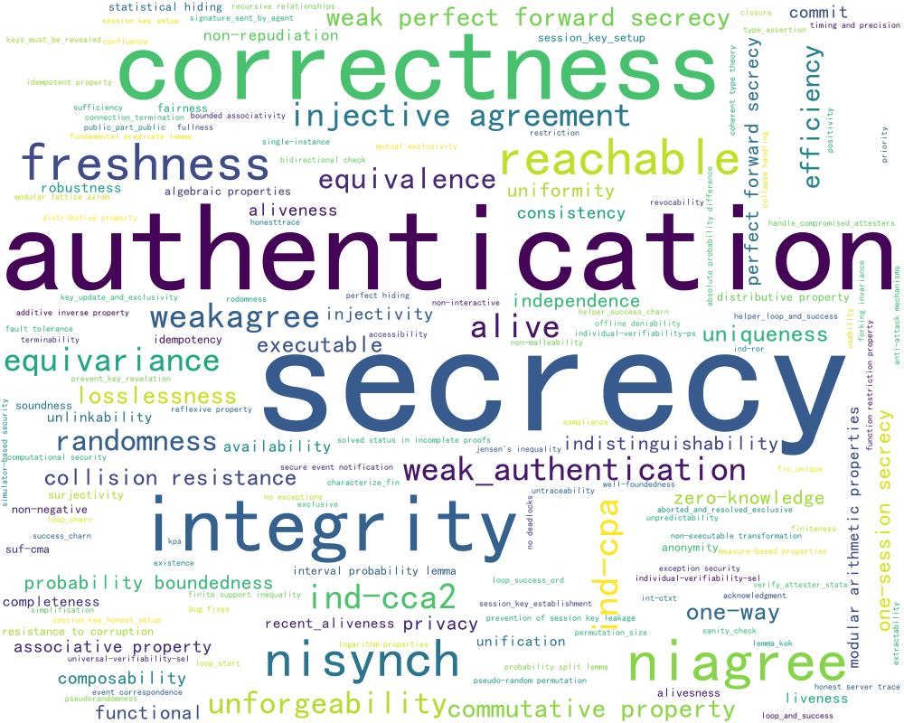

# CrypFormBench (C.F.B) · Benchmarking LLMs for Formal Analysis of Cryptographic Schemes

<p align="center">
  
</p>

<p align="center">
  <a href="#-quick-links"></a>
  <a href="#-results--figures"></a>
  <a href="#-license"></a>
  <a href="#-citing"></a>
</p>

> **Goal:** A reproducible benchmark + toolkit to evaluate LLMs on **interpreting, generating, completing, converting, and fixing** formal specifications of cryptographic schemes and protocols across multiple verification frameworks.

---

### View web page on https://github.com/Eval4LLMs/CrypFormBench/tree/master/bench.html

## 🔗 Quick Links

- **[Leaderboard Snapshot](https://chatgpt.com/?temporary-chat=true#-leaderboard-snapshot)** · **[Datasets**](https://chatgpt.com/?temporary-chat=true#-datasets)** · **[Quick Start](https://chatgpt.com/?temporary-chat=true#-quick-start)** · **[Reproduce the Benchmark](https://chatgpt.com/?temporary-chat=true#-reproducing-the-benchmark)** · **[Evaluate a New Model](https://chatgpt.com/?temporary-chat=true#-evaluate-a-new-model)**
- **[Repository Layout](https://chatgpt.com/?temporary-chat=true#-repository-layout)** · **[Data Formats](https://chatgpt.com/?temporary-chat=true#-data-formats--conventions)** · [Results & Figures](https://chatgpt.com/?temporary-chat=true#-results--figures)**
- **[References](https://chatgpt.com/?temporary-chat=true#-references)** · **[FAQ](https://chatgpt.com/?temporary-chat=true#-faq)**

---

## 🏆 Overall Leaderboard (recomputed by §4.5)

> **S_overall (recalc)** uses §4.5: executable tasks use \(S_\text{task}=\mathrm{HM}(a,\mathrm{HM}(\mathrm{ACC}_A,\mathrm{F1}_A))\);  
> interpretation uses \(\alpha s_\text{logic}+\beta s_\text{anno}+(1-\alpha-\beta)\mathrm{HM}(a,\mathrm{HM}(\mathrm{ACC}_A,\mathrm{F1}_A))\) with \(\alpha=\beta=0.3\).  
> Overall weights: gen 0.25, comp 0.20, trans 0.25, corr 0.15, interp 0.15.

<!-- LEADERBOARD_OVERALL:BEGIN -->

<table>
  <thead>
    <tr>
      <th align="right">Rank</th>
      <th align="left">Model</th>
      <th align="center">S_overall (recalc)</th>
      <th align="left">Progress</th>
      <th align="left">Badge</th>
    </tr>
  </thead>
  <tbody>
    <tr>
      <td align="right">🥇 1</td>
      <td><b>Claude-3.5-Sonnet-Coder</b></td>
      <td align="center"><b>51.0</b></td>
      <td>██████████░░░░░░░░░ (51%)</td>
      <td></td>
    </tr>
    <tr>
      <td align="right">🥈 2</td>
      <td><b>DeepSeek-Coder</b></td>
      <td align="center"><b>38.6</b></td>
      <td>████████░░░░░░░░░░░ (39%)</td>
      <td></td>
    </tr>
    <tr>
      <td align="right">🥉 3</td>
      <td><b>GPT-4o</b></td>
      <td align="center"><b>35.0</b></td>
      <td>███████░░░░░░░░░░░░ (35%)</td>
      <td></td>
    </tr>
    <tr>
      <td align="right">4</td>
      <td>DeepSeek-R1</td>
      <td align="center">34.6</td>
      <td>███████░░░░░░░░░░░░ (35%)</td>
      <td></td>
    </tr>
    <tr>
      <td align="right">5</td>
      <td>LLaMA4-Instruct</td>
      <td align="center">27.8</td>
      <td>█████░░░░░░░░░░░░░ (28%)</td>
      <td></td>
    </tr>
    <tr>
      <td align="right">6</td>
      <td>GPT-4o-mini</td>
      <td align="center">23.0</td>
      <td>█████░░░░░░░░░░░░░ (23%)</td>
      <td></td>
    </tr>
    <tr>
      <td align="right">7</td>
      <td>Gemini-2.5-Pro</td>
      <td align="center">22.8</td>
      <td>█████░░░░░░░░░░░░░ (23%)</td>
      <td></td>
    </tr>
    <tr>
      <td align="right">8</td>
      <td>Grok-3</td>
      <td align="center">18.0</td>
      <td>███░░░░░░░░░░░░░░░ (18%)</td>
      <td></td>
    </tr>
    <tr>
      <td align="right">9</td>
      <td>GLM-4</td>
      <td align="center">16.1</td>
      <td>███░░░░░░░░░░░░░░░ (16%)</td>
      <td></td>
    </tr>
  </tbody>
</table>
<!-- LEADERBOARD_OVERALL:END -->

---

## 🧭 Capability Leaderboards (recomputed)

> Executable tasks: \(S_\text{task}=\mathrm{HM}(a,\mathrm{HM}(\mathrm{ACC}_A,\mathrm{F1}_A))\).  
> Interpretation uses similarity-weighted formula (\(\alpha=\beta=0.3\)). Scores in [0,100].

### 📝 Interpret
<!-- LEADERBOARD_INTERPRET:BEGIN -->

| Rank | Model                     | S_interpret (recalc) |
|:-----:|---------------------------|:--------------------:|
| 🥇 1 | GPT-4o                    | **94.1**             |
| 🥈 2 | GPT-4o-mini               | 93.8                 |
| 🥉 3 | DeepSeek-Coder            | 93.2                 |
| 4    | Claude-3.5-Sonnet-Coder   | 91.7                 |
| 5    | DeepSeek-R1               | 77.4                 |
| 6    | Gemini-2.5-Pro            | 69.1                 |
| 7    | GLM-4                     | 62.3                 |
| 8    | Grok-3                    | 49.6                 |
| 9    | LLaMA4-Instruct           | 44.4                 |

<!-- LEADERBOARD_INTERPRET:END -->

### 🧱 Generate
<!-- LEADERBOARD_GENERATE:BEGIN -->
| Rank | Model                     | S_generate (recalc) |
|:----:|---------------------------|:-------------------:|
| 🥇 1 | Claude-3.5-Sonnet-Coder   | **24.2**            |
| 🥈 2 | Grok-3                    | 12.8                |
| 🥉 3 | GPT-4o                    | 9.5                 |
| 4    | Gemini-2.5-Pro            | 7.7                 |
| 5    | DeepSeek-Coder            | 5.8                 |
| 6    | DeepSeek-R1               | 5.8                 |
| 7    | LLaMA4-Instruct           | 5.8                 |
| 8    | GLM-4                     | 0.0                 |
| 9    | GPT-4o-mini               | 0.0                 |

<!-- LEADERBOARD_GENERATE:END -->

### 🧩 Complete
<!-- LEADERBOARD_COMPLETE:BEGIN -->
| Rank | Model                     | S_complete (recalc) |
|:----:|---------------------------|:-------------------:|
| 🥇 1 | Claude-3.5-Sonnet-Coder   | **74.4**            |
| 🥈 2 | DeepSeek-Coder            | 68.0                |
| 🥉 3 | DeepSeek-R1               | 65.2                |
| 4    | LLaMA4-Instruct           | 55.6                |
| 5    | GPT-4o                    | 51.5                |
| 6    | Grok-3                    | 36.7                |
| 7    | Gemini-2.5-Pro            | 25.9                |
| 8    | GLM-4                     | 22.8                |
| 9    | GPT-4o-mini               | 10.9                |

<!-- LEADERBOARD_COMPLETE:END -->

### 🛠 Correction
<!-- LEADERBOARD_FIX:BEGIN -->
| Rank | Model                     | S_fix (recalc) |
|:----:|---------------------------|:--------------:|
| 🥇 1 | Claude-3.5-Sonnet-Coder   | **71.2**       |
| 🥈 2 | DeepSeek-Coder            | 63.9           |
| 🥉 3 | LLaMA4-Instruct           | 57.2           |
| 4    | DeepSeek-R1               | 56.9           |
| 5    | GPT-4o                    | 54.7           |
| 6    | GPT-4o-mini               | 44.8           |
| 7    | Gemini-2.5-Pro            | 35.6           |
| 8    | GLM-4                     | 14.5           |
| 9    | Grok-3                    | 0.0            |

<!-- LEADERBOARD_FIX:END -->

### 🔁 Convert
<!-- LEADERBOARD_CONVERT:BEGIN -->
| Rank | Model                     | S_convert (recalc) |
|:----:|---------------------------|:------------------:|
| 🥇 1 | Claude-3.5-Sonnet-Coder   | **22.7**           |
| 2–9  | Others                    | 0.0                |

<!-- LEADERBOARD_CONVERT:END -->

---

## 🗂️ Datasets

Our dataset is curated to reflect the **full lifecycle of cryptographic protocols/schemes**—from *design-time intent* to *implementation-level artifacts*—and to exercise models across **multiple formal languages**, **attacker models**, and **security properties**.

<div align="center">
  
  
  <br>
  <sub><b>Left:</b> Word cloud of schemes/protocols. · <b>Right:</b> Word cloud of verified properties.</sub>
</div>


> In short: **design** covers what the scheme is intended to guarantee (symbolic & computational properties), while **implementation** highlights what the low-level crypto code is checked for with <i>Jasmin</i>, aligning the model’s reasoning from specs to realizations.

### What it covers

- **Stages (design → implementation)**
  - **Design security (scheme-level)**: natural-language specs, goal statements, role/I/O and trust assumptions (e.g., secrecy, authentication, integrity, freshness, forward secrecy, equivalence, IND-)
  - **Structured designs**: message-sequence charts, role tables, state machines
  - **Implementation security (Jasmin-level)**: artifacts and checks around low-level crypto code in **Jasmin**, focusing on side-channel discipline (e.g., constant-time style) and verifier-guided sanity checks that complement the formal specs.
- **Tasks & capabilities**
  - **Interpret** (explain/annotate formal code)
  - **Generate** (from scratch, guided by goals/assumptions)
  - **Complete** (fill missing blocks in valid specs)
  - **Convert** (cross-language translation with semantics preserved)
  - **Fix** (syntax- and semantics-guided repair using verifier feedback)
- **Security properties (symbolic & computational)**
  - **Secrecy/confidentiality**, **authentication** (entity, mutual, injective/non-injective), **integrity**
  - **Freshness**, **replay resistance**, **session binding**, **channel binding**
  - **Forward secrecy / PFS**, **KCI/AKC resistance**, **key compromise resilience**
  - **Unlinkability/anon/pseudonymity**, **agreement** (aliveness/weak/strong), **resistance to MitM**
  - **IND-CPA/IND-CCA families** (in computational settings), **equivalence** properties (trace/bihyper)
- **Attacker models**
  - **Dolev–Yao** network adversary, **state reveal/ephemeral key leak**, **CK/eCK**-style models
  - Tool-specific backends and semantics (e.g., ProVerif queries, Tamarin lemmas, AVISPA backends, Maude-NPA equational theories, CryptoVerif/EasyCrypt reductions)
- **Languages & tools**
  - **ProVerif**, **Tamarin**, **Scyther**, **Maude-NPA**, **AVISPA**, **CryptoVerif**, **EasyCrypt**
  - Each instance includes *tool config, timeouts, flags*, and expected verdict normalization

---

## 🚀 Quick Start

> **Requirements:** Python 3.10+ and `pip`. External verifiers are optional if you only run aggregation/plotting on provided logs.

```bash
# 1) Clone
git clone https://github.com/Eval4LLMs/CrypFormBench.git
cd CrypFormBench

# 2) (Optional) Virtual env
python -m venv .venv
source .venv/bin/activate   # Windows: .venv\Scripts\activate

# 3) Install
pip install -r code/requirements.txt

# 4) Sanity checks
python -m code.tools.check_repo

# 5) Rebuild metrics from existing outputs + logs
python -m code.metrics.aggregate \
  --model-outputs model_outputs \
  --original-results original_results \
  --out calculated_results

# 6) Generate all figures
python -m code.viz.plot_all \
  --in calculated_results \
  --out result_figures
```

> 💡 No verifier installed? You can still reproduce tables/plots from `original_results/`.

---

## 🧪 Reproducing the Benchmark

**Pipeline:** *generate → verify → score → visualize*

1. **Generate model outputs**

```bash
python -m code.run.generate \
  --model gpt-4o \
  --tasks datasets/tasks.yaml \
  --prompts datasets/prompts \
  --out model_outputs/gpt-4o
```

2. **Verify with external tools** (ProVerif, Tamarin, Scyther, Maude-NPA, AVISPA, CryptoVerif, EasyCrypt…)

```bash
python -m code.run.verify \
  --inputs model_outputs/gpt-4o \
  --tool-config code/tools/tools.yaml \
  --out original_results/gpt-4o
```

3. **Score & aggregate**

```bash
python -m code.metrics.aggregate \
  --model-outputs model_outputs/gpt-4o \
  --original-results original_results/gpt-4o \
  --out calculated_results/gpt-4o
```

4. **Visualize**

```bash
python -m code.viz.plot_all \
  --in calculated_results \
  --out result_figures
```

---

## 📦 Repository Layout

```
├─ calculated_results/   # Derived metrics & summary tables (per model / per task)
├─ code/                 # Runners, scorers, plotting, tool adapters, sanity checks
│  ├─ run/               # generate.py, verify.py
│  ├─ metrics/           # aggregate.py, scoring utilities
│  ├─ viz/               # plot_all.py, figure helpers
│  └─ tools/             # external tool wrappers, configs, schema checks
├─ datasets/             # Capability descriptions, tasks, prompts, schemas
│  ├─ prompts/           # Prompt templates per task/language
│  └─ README.md          # Dataset documentation & taxonomy
├─ model_outputs/        # Raw generations (model × task)
├─ original_results/     # Verifier logs / normalized verdicts
├─ result_figures/       # Publication-ready plots (PNG/SVG/PDF)
└─ overview.png          # High-level pipeline diagram
└─ bench.html            # View of HTML File
```

---

## 🧰 Data Formats & Conventions

**Task spec (`datasets/`)**

* `id`, `language` (proverif, tamarin, scyther, avv, maude-npa, cryptoverif, easycrypt)
* `capability` (interpret | generate | complete | convert | fix)
* `properties` (goals, attacker model, equivalence/reachability, etc.)
* `inputs` (prompts, partial specs, seeds)
* `evaluation` (tool, flags, timeouts)

**Model outputs (`model_outputs/<model>/<task_id>.*`)**

* The exact artifact for the tool (e.g., `.pv`, `.spthy`, `.if`, `.maude`, `.ocv`, `.ec`)
* Sidecar JSON: generation params, prompt hash, timestamp

**Verification logs (`original_results/<model>/<task_id>.log` + `…verdict.json`)**

* Raw stdout/stderr
* Normalized verdict:

```json
  {"analyzable": true, "status": "safe|attack|unknown|error",
   "time_sec": 3.21, "tool_version": "x.y.z"}
```

**Calculated results (`calculated_results/`)**

* Per-task: analyzability `a`, accuracy on analyzable set `ACC_A`, `F1_A`, runtime stats
* Aggregates: by capability, by language, and overall scores

---

## 📊 Results & Figures

All figures in **`result_figures/`** are generated from **`calculated_results/`**.

Common plots:

* Capability comparison (interpret/generate/complete/convert/fix)
* Per-language breakdown
* Analyzability vs. correctness scatter
* Runtime distributions & failure taxonomy (if available)

Rebuild:

```bash
python -m code.viz.plot_all --in calculated_results --out result_figures
```

---

## ➕ Evaluate a New Model

```bash
# 1) Add your model (API or local) in your config
# 2) Generate
python -m code.run.generate \
  --model <your-model> \
  --tasks datasets/tasks.yaml \
  --prompts datasets/prompts \
  --out model_outputs/<your-model>

# 3) (Optional) Verify to produce original_results/<your-model>/
python -m code.run.verify \
  --inputs model_outputs/<your-model> \
  --tool-config code/tools/tools.yaml \
  --out original_results/<your-model>

# 4) Aggregate & plot
python -m code.metrics.aggregate \
  --model-outputs model_outputs/<your-model> \
  --original-results original_results/<your-model> \
  --out calculated_results/<your-model>
python -m code.viz.plot_all \
  --in calculated_results/<your-model> \
  --out result_figures
```

---

## 🧩 Extend with a New Task / Language

* Add a task spec under `datasets/` and its prompt(s) under `datasets/prompts/`.
* New backend? Implement a wrapper in `code/tools/` exposing:

  * `prepare(inputs) -> artifact_path`
  * `run(artifact_path, timeout, flags) -> (raw_log, normalized_verdict_json)`
* Register the task in `datasets/tasks.yaml`.
* (Optional) Update plotting to include the new language/capability.

---

## ❓ FAQ

**Do I need every verifier installed?**
No. Use `original_results/` to run scoring/plotting without local tools.

**What metrics do you report?**
Analyzability `a`, `ACC_A`, `F1_A` on the analyzable subset, plus capability-, language-, and overall aggregates. Runtime/error breakdowns when available.

**Are prompts fixed?**
Yes—prompt templates and inputs in `datasets/` ensure exact replication. Add a new prompt set with a new ID if you want variants.

---

## 📜 License

Add your license here (e.g., MIT). If any dataset includes third-party material, ensure redistribution is permitted and credit original sources.

---

> **Reproducibility first.** From raw model outputs to final plots, everything is scripted and deterministic—so others can re-run your exact pipeline with a few commands.

## 📚 References

- **ProVerif** — Bruno Blanchet. *Automatic Verification of Security Protocols with Secrecy and Authentication.* (Foundational docs and subsequent manuals).
- **Tamarin Prover** — Benedikt Schmidt, Santiago G. Álvarez, David Basin et al. *Automated Verification of Security Protocols with Tamarin.*
- **Scyther** — Cas Cremers. *Scyther: Semantics and Verification of Security Protocols.*
- **AVISPA** — Alessandro Armando et al. *The AVISPA Tool for the Automated Validation of Internet Security Protocols and Applications.*
- **Maude-NPA** — Santiago Escobar, Catherine Meadows, José Meseguer et al. *Maude-NPA: Cryptographic Protocol Analysis Modulo Equational Properties.*
- **CryptoVerif** — Bruno Blanchet. *A Computationally Sound Mechanized Prover for Security Protocols.*
- **EasyCrypt** — Gilles Barthe, Benjamin Grégoire, Sylvain Heraud, Santiago Zanella-Béguelin et al. *Computer-Aided Security Proofs for Cryptographic Programs.*
- **Symbolic vs. Computational** — Ran Canetti; Shoup; Bellare & Rogaway. Canonical works on UC, IND-CPA/CCA, and reductionist proofs.
- **Program Repair/Tool-in-the-Loop** — Works on syntax- and feedback-guided repair that inspire our “fix” tasks and verifier-feedback loops.