# Datasets — CrypFormBench (C.F.B)

Recomputed metrics and figures for the formal evaluation of cryptographic schemes.
This folder contains **five capability subfolders** and a set of **coverage/distribution images**.

## Folder layout (what you have here)

```
calculated_results/
├─ completion/           # Completion capability artifacts
├─ correction/           # Correction (Fix/Repair) capability artifacts
├─ generation/           # Generation capability artifacts
├─ interpretation/       # Interpretation capability artifacts
├─ transformation/          # Transformation/Convert capability artifacts
├─ hlpsl_propeties.png
├─ hlpsl_protocols.png
├─ maude_propeties.png
├─ maude_protocols.png
├─ Property Distribution.png
├─ propeties.png
├─ propeties_count.png
├─ propeties_count2.png
├─ propeties_count3.png
├─ protocols.png
├─ pv_propeties.png
├─ pv_protocols.png
├─ Security Property.png
├─ spdl_propeties.png
├─ spdl_protocols.png
├─ spthy_propeties.png
├─ spthy_protocols.png
└─ README.md   # (this file)
```

> Note: Filenames such as `propeties*.png` reflect the original asset names.

---

## Dataset coverage — global views

* **Protocols (global word cloud)**
  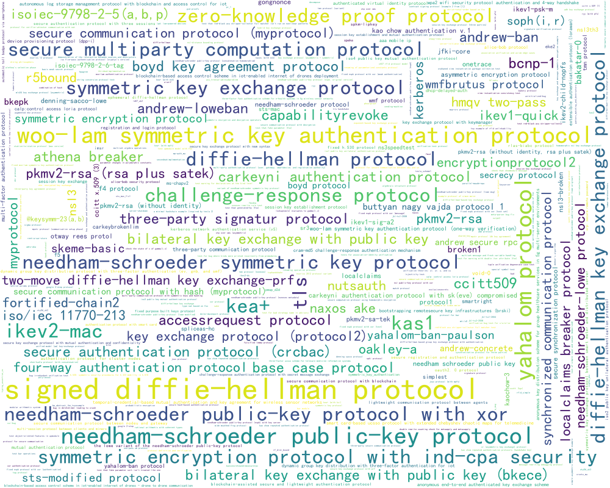

* **Properties (global word cloud)**
  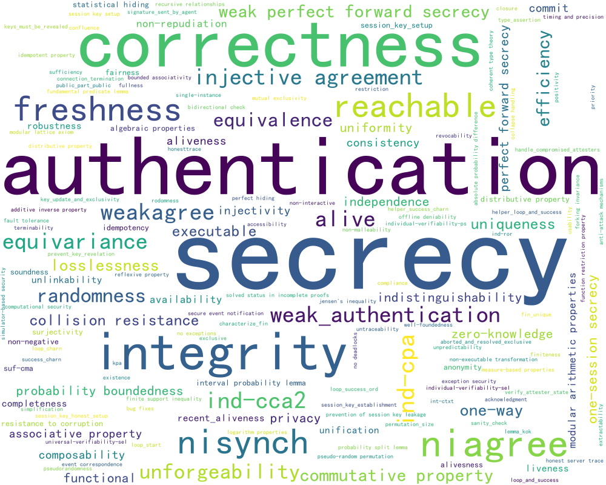

* **Security properties (bar view)**
  

* **Property distribution (matrix/heatmap)**
  

* **Property counts (variants 1–3)**

  | Count 1                       | Count 2                        | Count 3                        |
  | ----------------------------- | ------------------------------ | ------------------------------ |
  | 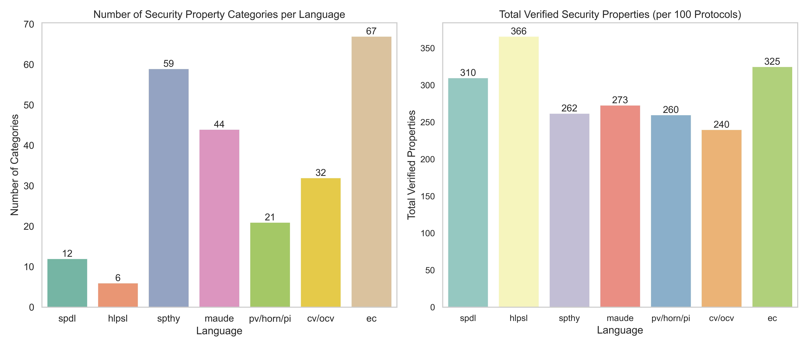 | 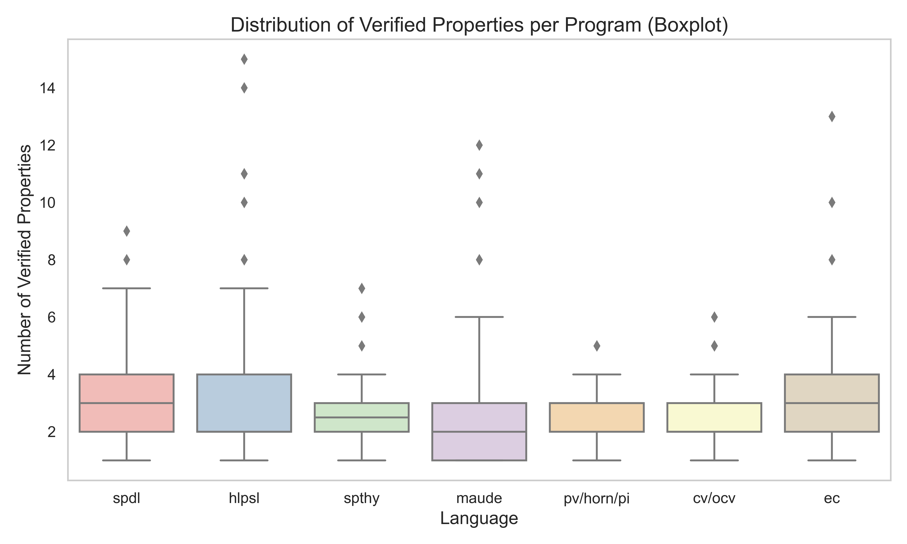 | 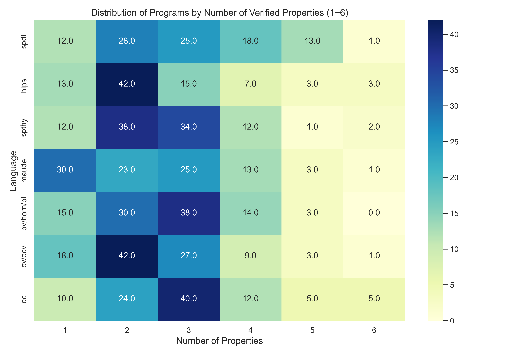 |

---

## Per-language coverage snapshots

| Formal language / Tool | Protocols                                | Properties                               |
| ---------------------- | ---------------------------------------- | ---------------------------------------- |
| **ProVerif**           | 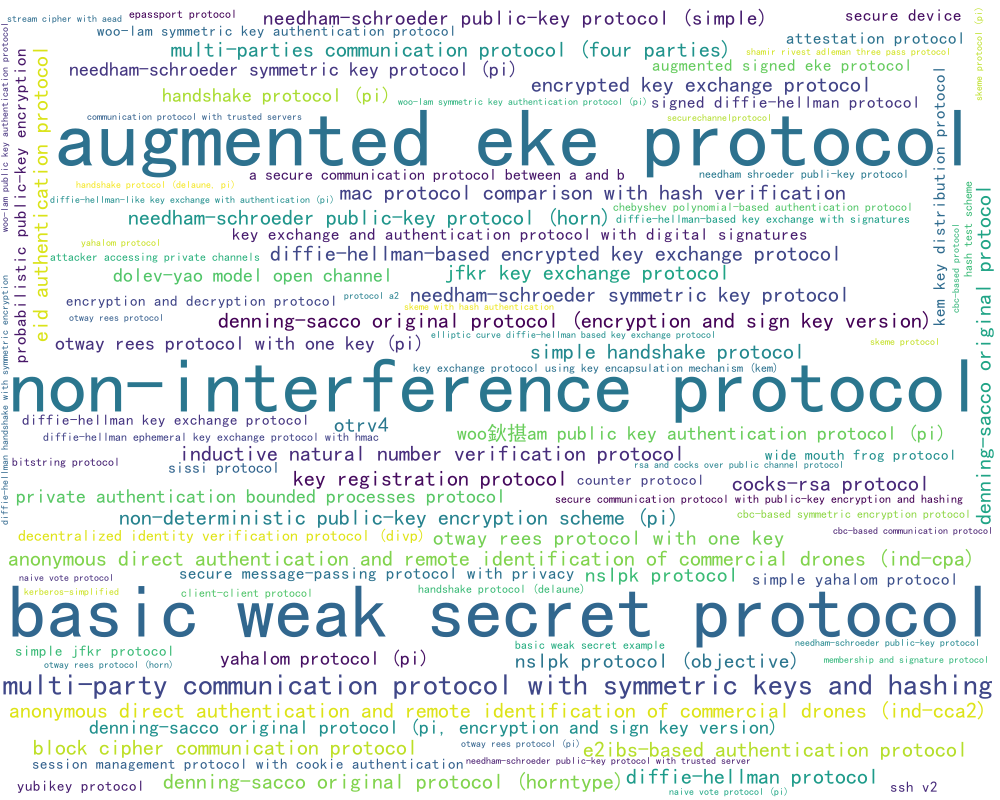       | 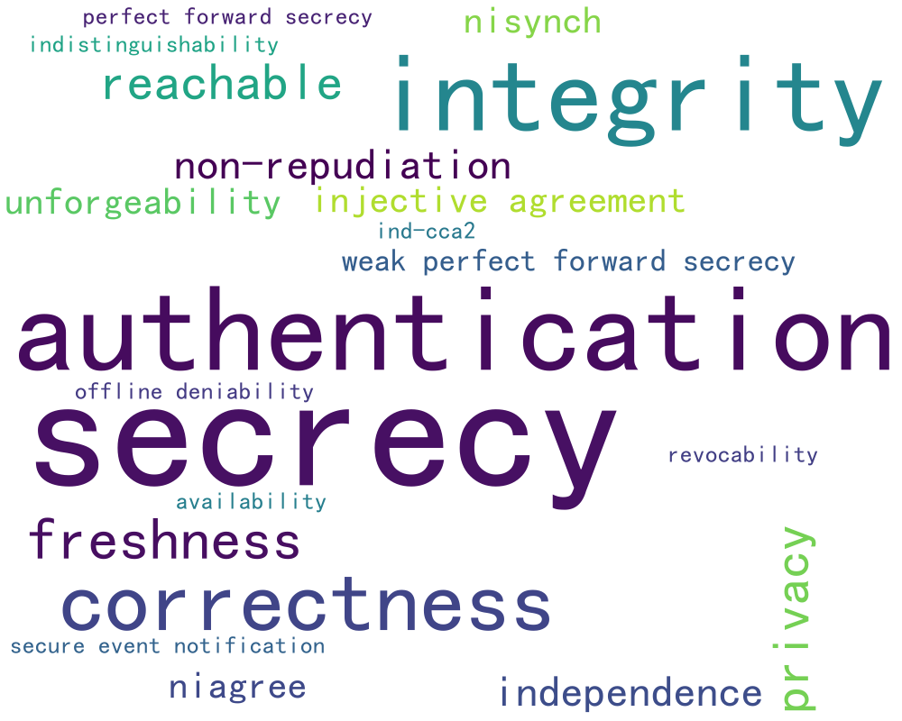       |
| **Tamarin** (`.spthy`) | 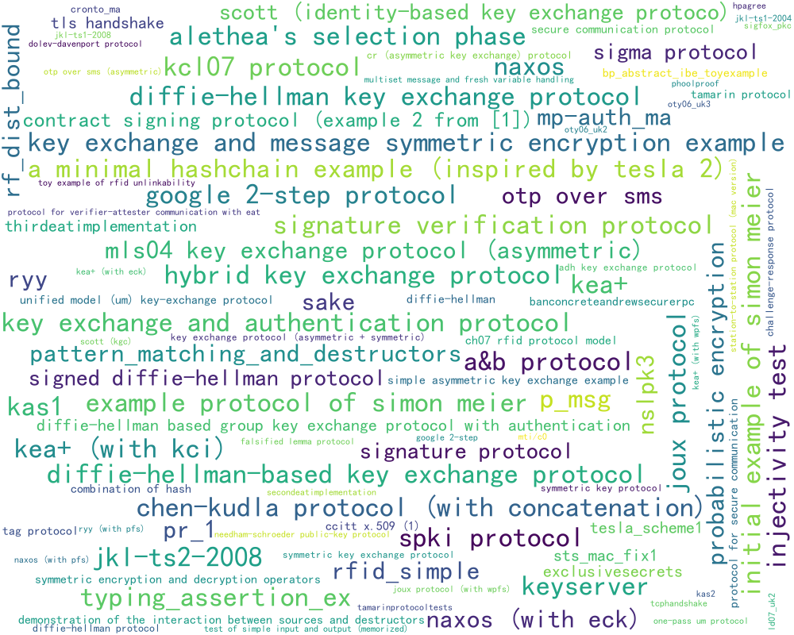 |  |
| **Scyther** (`.spdl`)  | 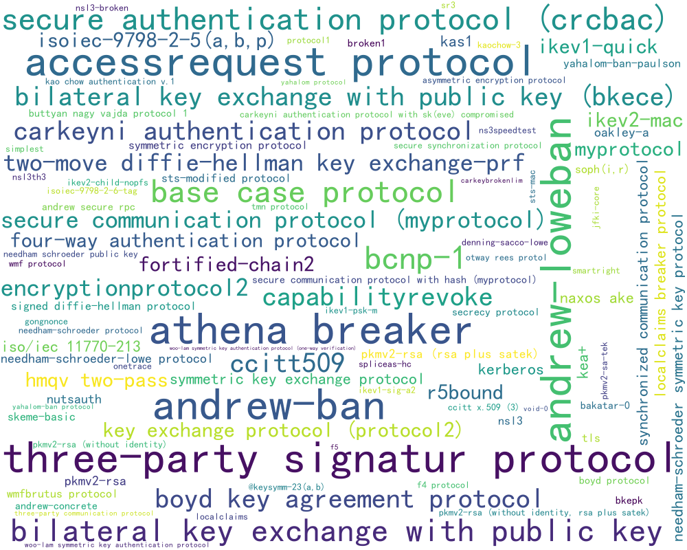   | 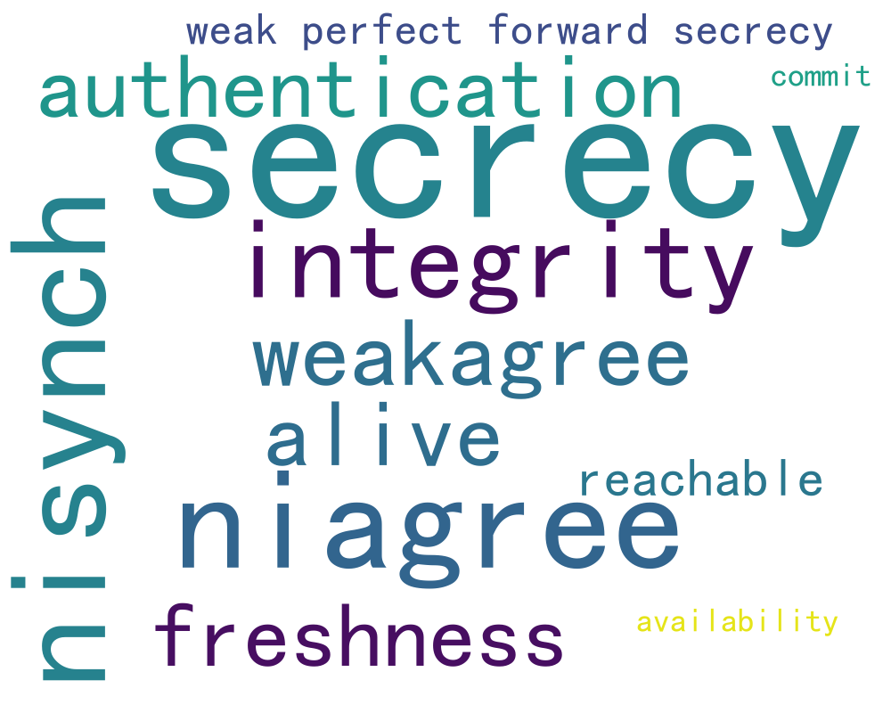   |
| **AVISPA/HLPSL**       | 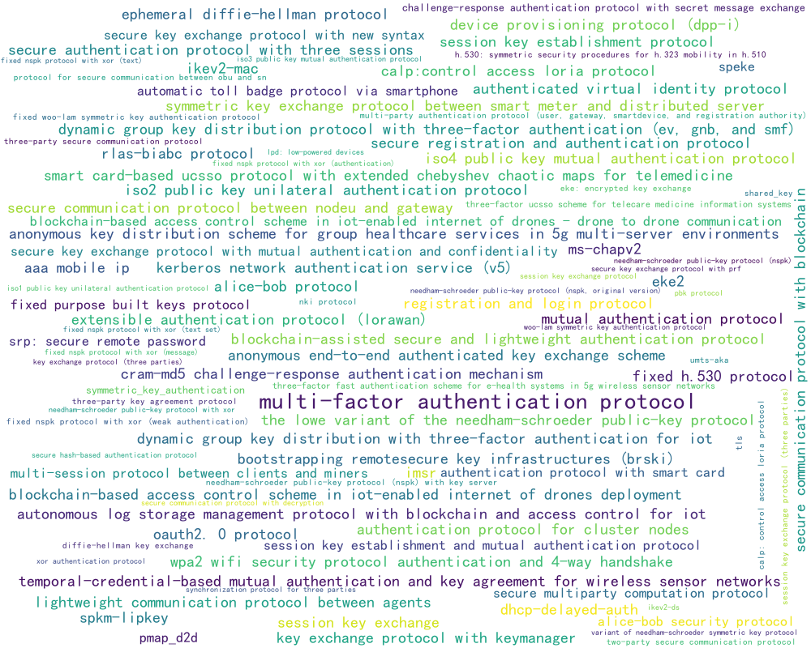 |  |
| **Maude-NPA**          | 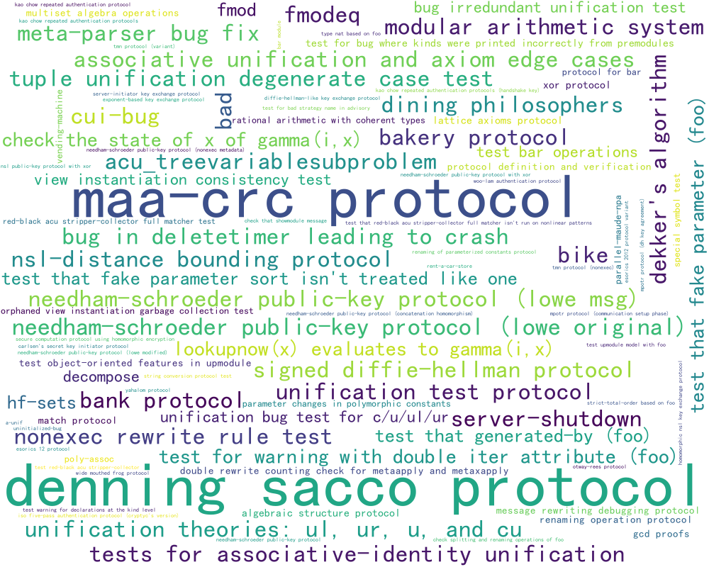 | 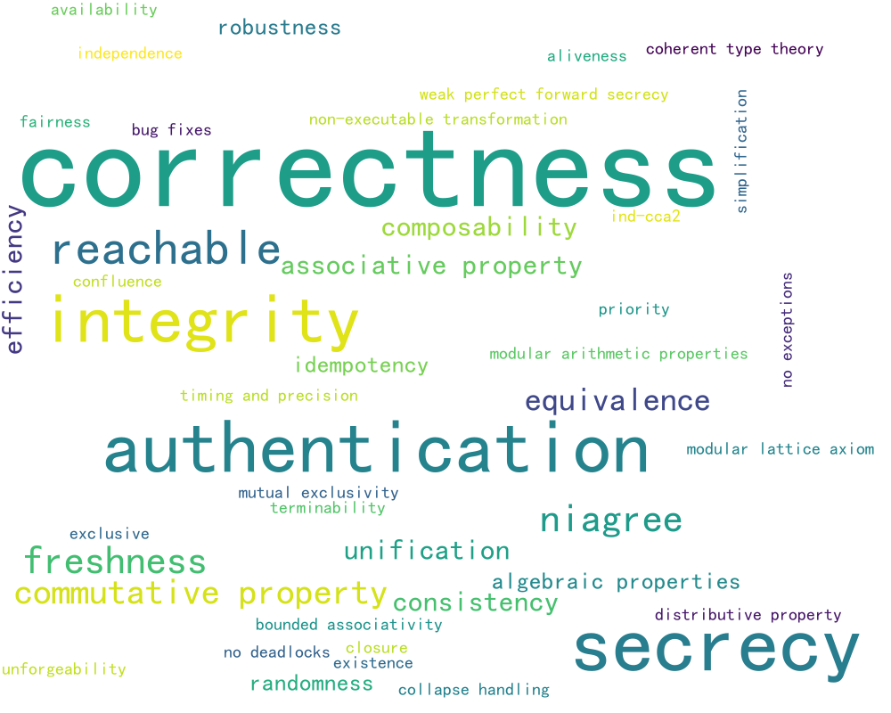 |

---

## 160 property labels taxonomy


### 1) Category Overview (A–K)

| Category | Scope (what it covers)                                                                           | Why this bucket exists (the reason)                                                                                                                                                       |
| -------- | ------------------------------------------------------------------------------------------------ | ----------------------------------------------------------------------------------------------------------------------------------------------------------------------------------------- |
| **A**    | Symbolic protocol security goals (secrecy/authentication/agreement/integrity + liveness signals) | Captures the *protocol-level* symbolic goals expressed as trace/correspondence properties (what you want the protocol to guarantee).                                                      |
| **B**    | Freshness / binding / session discipline / key lifecycle                                         | Captures constraints about *session structure*, *freshness/uniqueness*, *key establishment/setup*, *key lifecycle*, *reveal/leakage policies*, and *compromise handling*—orthogonal to A. |
| **C**    | Forward secrecy & compromise-resilience                                                          | Captures security under *compromise over time* (PFS variants, corruption resistance), which has distinct semantics from plain secrecy/authentication.                                     |
| **D**    | Reachability / executability / trace sanity & modeling restrictions                              | Captures *model sanity* and *feasibility* checks (can traces run? are restrictions consistent?) rather than security goals.                                                               |
| **E**    | Privacy / anonymity / deniability / repudiation & related goals                                  | Captures privacy-family properties (anonymity/unlinkability) and the accountability/repudiation axis (`offline deniability` vs `non-repudiation`) as a single top-level family.           |
| **F**    | Computational security notions & crypto primitive properties                                     | Captures *computational/game-based* notions (IND-CPA/CCA, SUF-CMA, etc.) and primitive-level properties, distinct from symbolic trace goals.                                              |
| **G**    | Proof / game / meta properties (soundness/correctness/probability lemmas, etc.)                  | Captures proof-system machinery and meta-lemmas (soundness, losslessness, probability/measure lemmas) rather than protocol security.                                                      |
| **H**    | Algebraic / rewriting / logic-structure properties                                               | Captures algebraic identities, rewriting-system structure, and logic infrastructure (commutativity, confluence, unification, termination, etc.).                                          |
| **I**    | Engineering / performance / reliability & misc quality                                           | Captures non-crypto quality attributes (efficiency, availability, fault tolerance, “no exceptions”, compliance/usability).                                                                |
| **J**    | Tool-/script-specific workflow markers (helper lemmas, internal checks)                          | Captures proof-script plumbing and internal markers (loops, helper checks, project-specific lemma names), not semantic security goals.                                                    |
| **K**    | Specification / query patterns (tool-level property shapes)                                      | Captures *how* properties are formulated in tools (event-correlation patterns, bidirectional checks), separate from goals (A/E) and notions (F).                                          |


### 2) Label Mapping Table (Exact Strings)

| Category | Included labels (exact strings)                                                                                                                                                                                                                                                                                                                                                                                                                                                                                                                                                                                                         |
| -------- | --------------------------------------------------------------------------------------------------------------------------------------------------------------------------------------------------------------------------------------------------------------------------------------------------------------------------------------------------------------------------------------------------------------------------------------------------------------------------------------------------------------------------------------------------------------------------------------------------------------------------------------- |
| **A**    | `secrecy`, `authentication`, `integrity`, `niagree`, `nisynch`, `injective agreement`, `weakagree`, `weak_authentication`, `alive`, `aliveness`, `alivesness` *(typo of aliveness)*, `recent_aliveness`, `liveness`, `acknowledgment`, `connection_termination`, `commit`                                                                                                                                                                                                                                                                                                                                                               |
| **B**    | `freshness`, `uniqueness`, `injectivity`, `session_key_setup`, `session key setup`, `session_key_honest_setup`, `session_key_establishment`, `prevention of session key leakage`, `keys_must_be_revealed`, `key_update_and_exclusivity`, `aborted_and_resolved_exclusive`, `mutual exclusivity`, `exclusive`, `prevent_key_revelation`, `verify_attester_state`, `handle_compromised_attesters`                                                                                                                                                                                                                                         |
| **C**    | `perfect forward secrecy`, `weak perfect forward secrecy`, `resistance to corruption`                                                                                                                                                                                                                                                                                                                                                                                                                                                                                                                                                   |
| **D**    | `reachable`, `executable`, `honesttrace`, `honest server trace`, `restriction`, `sanity_check`, `single-instance`, `solved status in incomplete proofs`                                                                                                                                                                                                                                                                                                                                                                                                                                                                                 |
| **E**    | `privacy`, `anonymity`, `unlinkability`, `untraceability`, `offline deniability`, `revocability`, `non-repudiation`                                                                                                                                                                                                                                                                                                                                                                                                                                                                                                                     |
| **F**    | `ind-cpa`, `ind-cca2`, `indistinguishability`, `ind-ror`, `int-ctxt`, `kpa`, `one-way`, `collision resistance`, `unforgeability`, `suf-cma`, `randomness`, `rodomness` *(typo of randomness)*, `pseudorandomness`, `pseudo-random permutation`, `unpredictability`, `non-malleability`, `extractability`, `zero-knowledge`, `statistical hiding`, `perfect hiding`, `computational security`, `one-session secrecy`, `non-interactive`                                                                                                                                                                                                  |
| **G**    | `correctness`, `equivalence`, `equivariance`, `losslessness`, `uniformity`, `probability boundedness`, `probability split lemma`, `interval probability lemma`, `fundamental predicate lemma`, `absolute probability difference`, `measure-based properties`, `soundness`, `completeness`, `sufficiency`, `reflexive property`, `independence`, `consistency`, `robustness`, `simplification`, `well-foundedness`, `finiteness`, `forking invariance`, `jensen's inequality`, `finite support inequality`, `function restriction property`, `recursive relationships`, `fullness`, `positivity`, `non-negative`, `logarithm properties` |
| **H**    | `commutative property`, `associative property`, `distributive property`, `distributive property ` *(trailing space)*, `algebraic properties`, `modular arithmetic properties`, `modular lattice axiom`, `bounded associativity`, `idempotency`, `idempotent property`, `additive inverse property`, `surjectivity`, `unification`, `closure`, `existence`, `confluence`, `terminability`, `composability`                                                                                                                                                                                                                               |
| **I**    | `efficiency`, `availability`, `accessibility`, `fault tolerance`, `timing and precision`, `priority`, `no deadlocks`, `no exceptions`, `exception security`, `bug fixes`, `compliance`, `usability`, `anti-attack mechanisms`, `functional`                                                                                                                                                                                                                                                                                                                                                                                             |
| **J**    | `loop_start`, `loop_success_ord`, `loop_charn`, `helper_loop_and_success`, `loop_and_success`, `helper_success_charn`, `success_charn`, `type_assertion`, `public_part_public`, `signature_sent_by_agent`, `permutation_size`, `non-executable transformation`, `lemma_kok`, `characterize_fin`, `fin_unique`                                                                                                                                                                                                                                                                                                                           |
| **K**    | `secure event notification`, `bidirectional check`, `event correspondence`                                                                                                                                                                                                                                                                                                                                                                                                                                                                                                                                                              |
### Uneven sample sizes across security properties and why we use a unified metric

We acknowledge that the label distribution is skewed: **secrecy (600)** and **authentication (349)** account for a large fraction of the corpus, while many other properties appear in a long tail. We did **not** apply any balancing or resampling. The resulting distribution reflects the protocol formalizations and tool testbeds included under our collection criteria, where secrecy/authentication-style goals are most frequently encoded, and more specialized notions (e.g., PFS variants, privacy goals, or application-specific invariants) are comparatively rarer.

Importantly, our claim of **160 distinct properties** does **not** imply uniform statistical power for every label. Rather, it highlights **coverage**: after normalization and deduplication, the taxonomy spans core symbolic goals (secrecy/authentication/integrity/agreement variants), compromise-resilience notions (PFS variants), privacy properties, and computational/proof obligations (e.g., IND-CPA/IND-CCA2, losslessness, and disciplined game-hopping steps). This breadth enables future *focused* studies on specific property families, while still retaining robust sample sizes for canonical goals that overlap with prior benchmarks.

We adopt a **single unified metric across tasks** because our primary objective is not per-label ranking in isolation, but **capability comparison across heterogeneous tasks and verifiers**. A unified score based on *executability* and *correctness on analyzable outputs* provides a consistent basis for evaluation even when: (i) different tools expose different goal granularities,  (ii) tasks emphasize different failure modes (parsing vs. semantic mismatch and. timeout), and (iii) long-tail labels are too sparse to support stable per-label model ranking. For transparency, we also report the metric’s component rates (e.g., executability/analyzability/correctness) and provide per-family breakdowns to contextualize performance on rarer properties.

In short, the unified metric targets **cross-task/cross-tool comparability**, while the 160-property labeling demonstrates **coverage and extensibility**, not uniform per-label sample balance.

---

## Capability results (subfolders)

Click into each folder for capability-specific tables/figures:

* [`completion/`](./completion/) — fill-in-the-blank / block completion tasks
* [`correction/`](./correction/) — syntax/semantics-guided repair (Fix)
* [`generation/`](./generation/) — spec generation from goals/assumptions
* [`interpretation/`](./interpretation/) — explain/annotate formal code
* [`transformation/`](./transformation/) — cross-language transform with preserved semantics