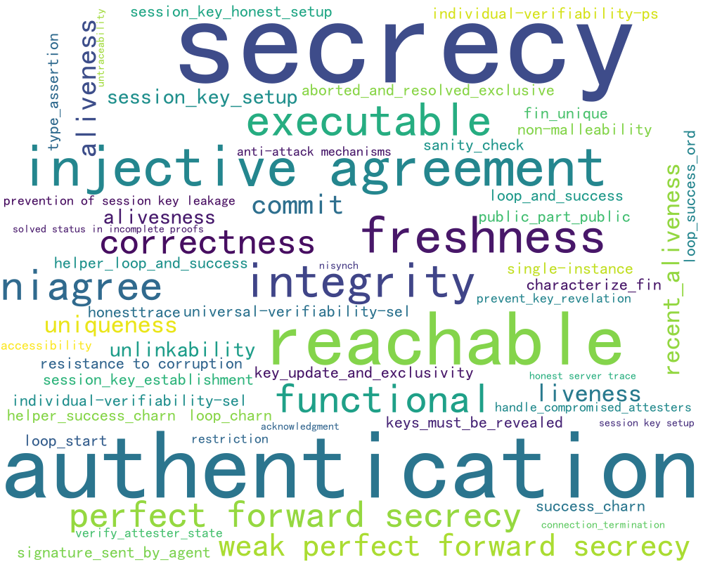

# Datasets — CrypFormBench (C.F.B)

Recomputed metrics and figures for the formal evaluation of cryptographic schemes.
This folder contains **five capability subfolders** and a set of **coverage/distribution images**.

## Folder layout (what you have here)

```
calculated_results/
├─ completion/           # Completion capability artifacts
├─ correction/           # Correction (Fix/Repair) capability artifacts
├─ generation/           # Generation capability artifacts
├─ interpretation/       # Interpretation capability artifacts
├─ translation/          # Transformation/Convert capability artifacts
├─ hlpsl_propeties.png
├─ hlpsl_protocols.png
├─ maude_propeties.png
├─ maude_protocols.png
├─ Property Distribution.png
├─ propeties.png
├─ propeties_count.png
├─ propeties_count2.png
├─ propeties_count3.png
├─ protocols.png
├─ pv_propeties.png
├─ pv_protocols.png
├─ Security Property.png
├─ spdl_propeties.png
├─ spdl_protocols.png
├─ spthy_propeties.png
├─ spthy_protocols.png
└─ README.md   # (this file)
```

> Note: Filenames such as `propeties*.png` reflect the original asset names.

---

## Dataset coverage — global views

* **Protocols (global word cloud)**
  

* **Properties (global word cloud)**
  

* **Security properties (bar view)**
  

* **Property distribution (matrix/heatmap)**
  

* **Property counts (variants 1–3)**

  | Count 1                       | Count 2                        | Count 3                        |
  | ----------------------------- | ------------------------------ | ------------------------------ |
  |  |  |  |

---

## Per-language coverage snapshots

| Formal language / Tool | Protocols                                | Properties                               |
| ---------------------- | ---------------------------------------- | ---------------------------------------- |
| **ProVerif**           |        |        |
| **Tamarin** (`.spthy`) |  |  |
| **Scyther** (`.spdl`)  |    |    |
| **AVISPA/HLPSL**       |  |  |
| **Maude-NPA**          |  |  |

---

## Capability results (subfolders)

Click into each folder for capability-specific tables/figures:

* [`completion/`](./completion/) — fill-in-the-blank / block completion tasks
* [`correction/`](./correction/) — syntax/semantics-guided repair (Fix)
* [`generation/`](./generation/) — spec generation from goals/assumptions
* [`interpretation/`](./interpretation/) — explain/annotate formal code
* [`translation/`](./translation/) — cross-language transform with preserved semantics