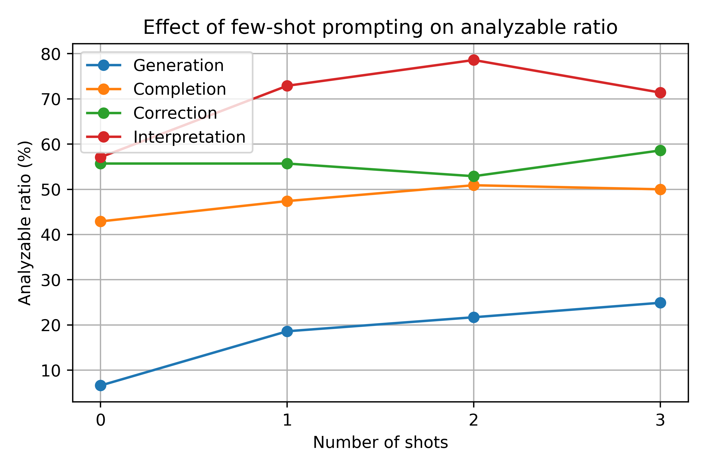
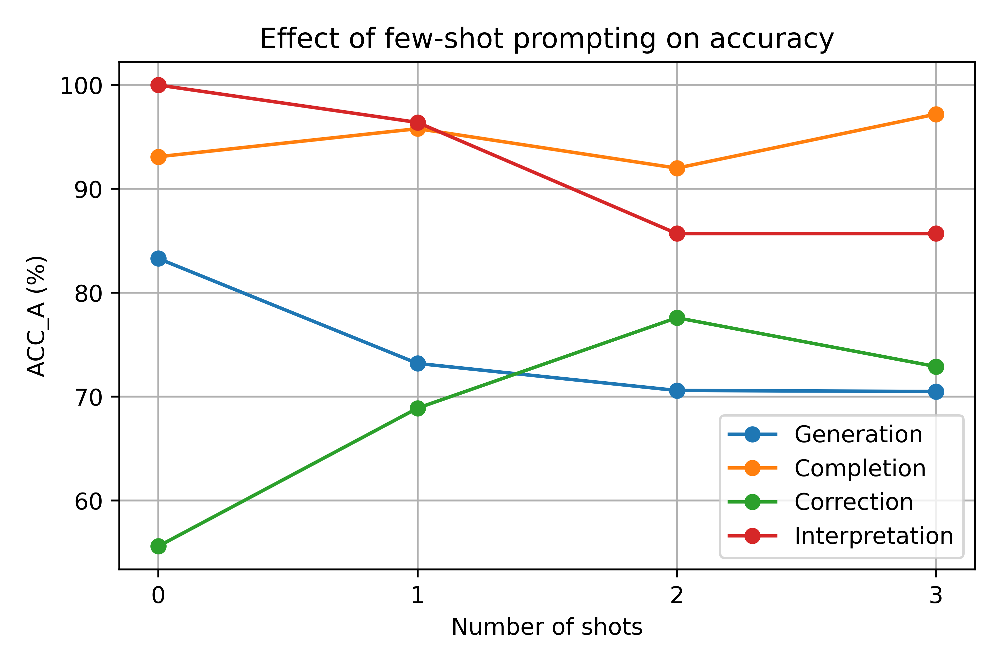
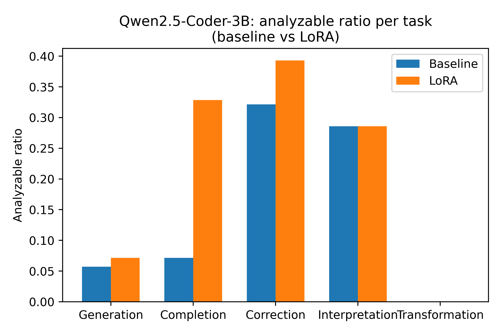
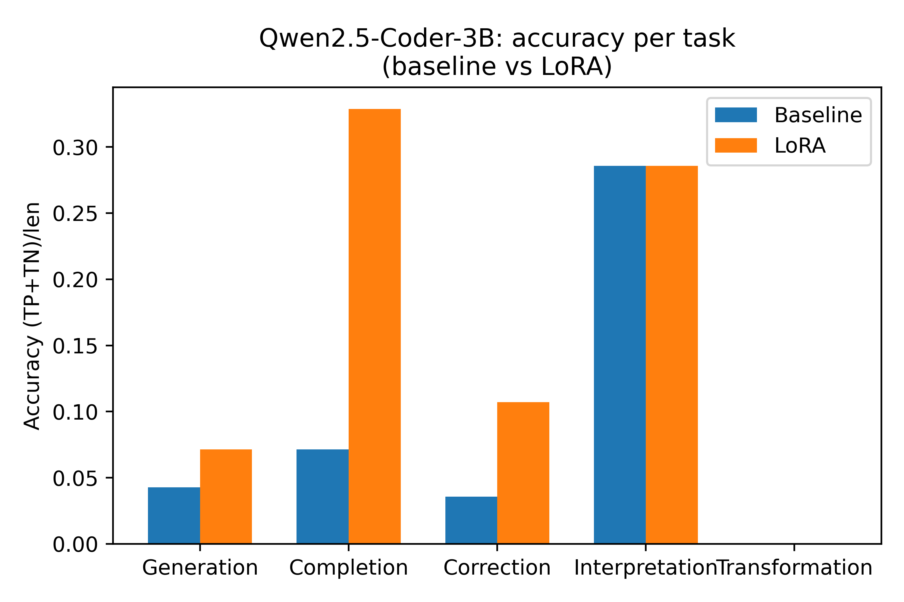
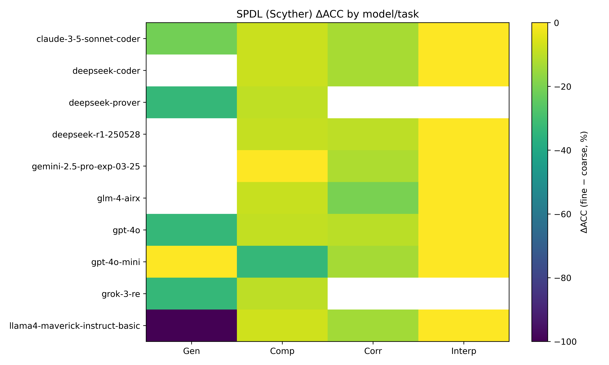
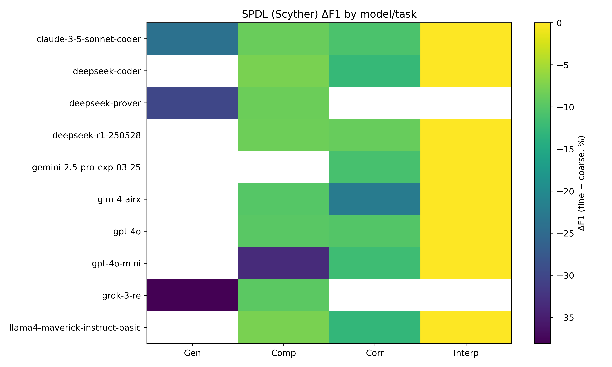

# Detailed author response

We thank all three reviewers for their careful reading and constructive feedback. We are glad that all reviewers find the benchmark useful and the problem important. Below we answer the specific questions from each reviewer.

------

## Response to Reviewer #1639A (R1)

We appreciate R1’s positive assessment of the contribution, dataset quality, and overall evaluation.

**A1. Basis and sensitivity for tunable parameters in §4.5 (and γ, λ, α, β).**

> *Q1. While the dataset and task design are described in detail, some aspects of the experimental design and evaluation process are not fully explained. For example, the selection of task weights lacks further theoretical or experimental justification. In Section 4.5, preset task weights are used, but the paper does not explain the rationale behind these weight choices. It would be beneficial to clarify whether these weights are based on theoretical or experimental results, or if they were set arbitrarily. Can you provide the basis for selecting the task weights in Section 4.5? Are they based on theoretical or experimental results?*

| Config ID                    | w_gen | w_comp | w_trans | w_corr | w_interp | α (logic) | β (annotation) | λ_err | λ_false | γ   |
| -------------------------------- | ----- | ------ | ------- | ------ | -------- | --------- | -------------- | ----- | ------- | --- |
| C1-Default                   | 0.25  | 0.20   | 0.25    | 0.15   | 0.15     | 0.50      | 0.50           | 0.40  | 0.60    | 1.0 |
| C2-Uniform                   | 0.20  | 0.20   | 0.20    | 0.20   | 0.20     | 0.50      | 0.50           | 0.40  | 0.60    | 1.0 |
| C3-GenTransHeavy             | 0.30  | 0.15   | 0.30    | 0.10   | 0.15     | 0.50      | 0.50           | 0.40  | 0.60    | 1.0 |
| C4-InterpShift + WeakPenalty | 0.25  | 0.20   | 0.20    | 0.15   | 0.20     | 0.60      | 0.40           | 0.50  | 0.50    | 0.5 |

 The above table summarizes four configurations of the scoring parameters, including task weights, interpretation sub-weights (α, β), correction sub-weights (λ_err, λ_false), and the analyzability penalty γ. For each configuration, we recompute all per-task scores and overall scores.

- C1: Current paper setting: as detailed in Section 4.5, task weights are designed based on difficulties; interpretation tasks balance logic and annotation; correction slightly emphasizes false-correctio; penalty strength at the standard level.
- C2: All tasks equally weighted, other sub-weights and penalties unchanged. Used to check that rankings are not driven by any single heavy-weighted task.
- C3: Puts more emphasis on generation and transformation (together 0.6). Completion/correction weights slightly reduced; explanation unchanged. Used to test ranking stability under amplified “hard tasks.”
- C4: Slightly increases interpretation weight; explanation task leans more toward logical reasoning (α > β); correction balances err/false penalties; overall penalty strength halved (γ = 0.5). Tests whether rankings persist when analyzability penalties are reduced.

 Across C1–C3, the per-task scores (Gen/Comp/Corr/Trans/Interp) are fixed and only the task weights w_t are changed. As shown in the above table, the global ranking is highly stable: Claude-3.5-Sonnet-Coder and DeepSeek-Coder consistently remain the top-1 and top-2 models, and GPT-4o, DeepSeek-R1, LLaMA4-Instruct, GPT-4o-mini, and Gemini-2.5-Pro preserve their relative order. Only the two weakest models (GLM-4 and Grok-3) swap positions at the bottom under uniform weights due to almost identical scores.

 Under C4 (higher weight on interpretation, logic-heavy sub-weights, balanced correction, and a weaker penalty), all models’ scores increase slightly due to the reduced analyzability penalty and higher emphasis on interpretation. However, the global ordering remains almost identical to the default configuration: Claude-3.5-Sonnet-Coder and DeepSeek-Coder are still ranked 1st and 2nd, GPT-4o / DeepSeek-R1 / LLaMA4-Instruct / GPT-4o-mini / Gemini-2.5-Pro form a stable mid-tier, and GLM-4 / Grok-3 remain at the bottom.

| Model                       | Overall (C1-Default) | Overall (C2-Uniform) | Overall (C3-GenTrans) | Overall (C4) |
|-----------------------------|----------------------|----------------------|-----------------------|--------------------|
| GLM-4                   | 16.1                 | 19.9                 | 14.2                  | 20.0               |
| LLaMA4-Instruct         | 27.8                 | 32.6                 | 22.5                  | 31.3               |
| DeepSeek-Coder          | 38.6                 | 46.2                 | 32.3                  | 45.2               |
| DeepSeek-R1             | 34.6                 | 41.1                 | 28.8                  | 40.1               |
| GPT-4o-mini             | 23.0                 | 29.9                 | 20.2                  | 29.3               |
| Gemini-2.5-Pro          | 22.8                 | 27.7                 | 20.1                  | 27.5               |
| GPT-4o                  | 35.0                 | 42.0                 | 30.2                  | 41.5               |
| Claude-3.5-Sonnet-Coder | 51.0                 | 56.8                 | 46.1                  | 56.5               |
| Grok-3                  | 18.0                 | 19.8                 | 16.8                  | 21.0               |

**A2. Few-shot prompt and fine-turn strategies.**

> *Q2. There is no discussion of certain prompt strategies (e.g., Few-shot) used in the evaluation. In Chapter 6, the paper discusses how Few-shot methods might improve the overall performance of the model. Given this, why were these strategies not directly employed in the evaluation? Would it be possible to include a comparison of the model's performance with and without the use of Few-shot strategies? Why wasn't the Few-shot strategy used in the evaluation? Can the authors explain why this approach was not incorporated, and whether a comparison of the results with and without Few-shot strategies could be included in the future?*

**A2.1. Effectiveness of few-shot prompt.**

 Thanks for asking about the impact of few-shot prompting. We have run a systematic 0/1/2/3-shot ablation on 10% of the dataset. The table below summarizes the average values of models:

| Setting | Gen analyzed | Gen ACC | Comp analyzed | Comp ACC | Corr analyzed | Corr ACC | Interp analyzed | Interp ACC |
|--------|--------------|---------|---------------|----------|---------------|----------|-----------------|------------|
| 0-shot | 6.6%         | 83.3%   | 42.9%         | 93.1%    | 55.7%         | 55.6%    | 57.1%           | 100.0%     |
| 1-shot | 18.6%        | 73.2%   | 47.4%         | 95.8%    | 55.7%         | 68.9%    | 72.9%           | 96.4%      |
| 2-shot | 21.7%        | 70.6%   | 50.9%         | 92.0%    | 52.9%         | 77.6%    | 78.6%           | 85.7%      |
| 3-shot | 24.9%        | 70.5%   | 50.0%         | 97.2%    | 58.6%         | 72.9%    | 71.4%           | 85.7%      |

 We observe three consistent trends: (i) Few-shot clearly helps, especially for generation. The average analyzable ratio for generation almost quadruples from 6.6% (0-shot) to 24.9% (3-shot) across languages and models. For completion, analyzable ratio increases from 42.9% → ≈50%, while ACC remains very high (>92%) for all K-shot settings. For correction and interpretation, the analyzable ratio is relatively stable, but ACC improves markedly (e.g., correction ACC from 55.6% → 72.9% with 3-shot).

 (ii) The gains are aligned with the structure of each verifier language.
Few-shot examples mainly help the model reproduce the scaffolding of each tool language: in HLPSL and SPDL generation, 0-shot outputs frequently miss global blocks such as protocol, role, or environment, or omit the goal section. With 2–3 shots, most generations include a complete skeleton (roles + goals), making them analyzable, even though some security goals may still be mis-specified. Also, in SPTHY and PV, 0-shot often forgets to declare events or to add the final secrecy/exists-trace queries. With few-shot, these blocks become much more systematic, which explains the increased analyzed ratio in generation/completion; remaining errors are more semantic (wrong event name or property) rather than raw syntax.

 (iii) Few-shot is not enough to “solve” analyzability for hard tools. Even with 3-shot, generation analyzability stays below 30% on average, and some tools remain particularly challenging: for Maude-NPA, most non-analyzable cases are due to semantic non-termination (e.g., overly nested terms or missing normalizing rules), leading to timeouts rather than parse errors. Few-shot reduces some superficial syntax issues but does not prevent such divergence. For computational tools (EasyCrypt, CryptoVerif), many few-shot generations parse, but fail later because game transitions or events are inconsistent (e.g., an event is referenced in the final bound but never defined). Few-shot helps the high-level structure (imports, module layout), but not yet the full proof discipline.

 Overall, these results indicate that few-shot prompting is clearly effective and improves both analyzability and accuracy, especially for generation and completion.

  
  

**A2.2. Effectiveness of fine-tuning.**

 To address the reviewer’s concern about whether the benchmark can also guide model improvement, we additionally fine-tune an open-source model, Qwen2.5-Coder-3B, using our benchmark data. For each task and tool language, we split the instances into 90% for LoRA fine-tuning and 10% for held-out evaluation, and trained a LoRA adapter on a single RTX 4090 GPU for 3 epochs.

 The counts of generations, analyzable outputs, and correct decisions before and after fine-tuning. Overall, we observe that: (i) For completion, the number of analyzable outputs increases from 5 → 23, and we obtain non-zero TP/TN counts (TP: 0 → 8, TN: 0 → 15). (ii) For correction, analyzable outputs also increase (9 → 11) and TP/TN slightly improve (TP: 1 → 2, TN: 0 → 1). (iii) For generation, the model remains weak, but the number of analyzable runs slightly improves (4 → 5), indicating that the adapter helps it follow the target tools’ syntax a bit more reliably. (iv) For interpretation, performance remains similar (4 analyzable samples for both, with the same TP/TN), which is expected since this is the easiest task and the base model already captures some properties. (v) For transformation, both models remain failing given the limited model size and the difficult task. 

 These results show that, even for a relatively small open-source model with a weak baseline, task-specific LoRA fine-tuning on C.F.B. can significantly improve analyzability and correctness on completion/correction tasks, while leaving the overall qualitative picture of task difficulty unchanged (generation and transformation are still much harder than interpretation/completion).

| Task            | Model               | #Generations | #Analyzed | deta TP | TN |
|-----------------|---------------------|--------------|-----------|----|----|
| Generation      | Qwen2.5-Coder-3B    | 63           | 4         | 0  | 3  |
|                 | Qwen2.5-Coder-3B-LoRA | 36         | 5         | 0  | 5  |
| Completion      | Qwen2.5-Coder-3B    | 44           | 5         | 0  | 5  |
|                 | Qwen2.5-Coder-3B-LoRA | 42         | 23        | 8  | 15 |
| Correction      | Qwen2.5-Coder-3B    | 15           | 9         | 1  | 0  |
|                 | Qwen2.5-Coder-3B-LoRA | 15         | 11        | 2  | 1  |
| Interpretation  | Qwen2.5-Coder-3B    | 6            | 4         | 1  | 3  |
|                 | Qwen2.5-Coder-3B-LoRA | 4          | 4         | 1  | 3  |
| Transformation  | Qwen2.5-Coder-3B    | 0            | 0         | 0  | 0  |
|                 | Qwen2.5-Coder-3B-LoRA | 0          | 0         | 0  | 0  |

  
  

**A3. Fine-grained analysis of security properties.**

> *Q3. Although the dataset includes 160 security properties, the paper mainly focuses on overall task-level evaluation and does not provide a detailed analysis of the validation results for individual security properties. While the dataset includes multiple security properties, the paper focuses mainly on task-level performance without detailed analysis of the results for different properties. Is this analysis necessary? Is there further consideration for granular analysis of security properties?*

We agree that evaluating models at the level of individual security properties is conceptually important. In the current version of the paper, we use a scheme-level label that aggregates all properties of a protocol via an XOR over the corresponding verification outcomes: if any checked goal is violated, the scheme is labeled as “attack”, otherwise “safe”. For example, for a DH-based protocol with secrecy and non-injective agreement, our label is “attack” as soon as either property is broken. As illustrated in §3.2.2, each protocol instance in CrypFormBench typically has 2–4 goals associated with it, and these goals are listed explicitly in the scheme description.

Extending this to automatically and fully fine-grained, per-property scoring across all 7 tools is non-trivial for two reasons. First, only some tools (e.g., Scyther/SPDL and Tamarin/SPTHY) expose a clear per-goal breakdown in their output. Others provide only a summary verdict (e.g., AVISPA, which returns only “SAFE/UNSAFE”), or require substantial engineering to parse traces and reason about goals (Maude-NPA, EasyCrypt, CryptoVerif). Second, another method is to refactor the dataset so that multi-goal scripts are split into several single-goal instances per tool, and redefine TP/TN/FP/FN per (scheme, property) pair. We outlined this as future work in the discussion section, but we agree that this point was not sufficiently emphasized.

To directly address the reviewer’s concern, we implemented a fine-grained evaluation for the Scyther (SPDL) and Tamarin (SPTHY) subsets in our rebuttal. Concretely, instead of assigning one label per scheme, we treat each (scheme, goal) as an instance. A generated or completed verification script is counted as:

- TP if the corresponding goal is encoded and the tool’s verdict matches the ground truth.
- FP if a safe goal is spuriously reported as an attack.
- FN if an expected goal is missing or its verdict is incorrect.
- TN if a safe goal is correctly verified as safe.

A scheme is only “fully correct” if all of its goals are covered and correct; missing goals are counted as FN at the property level.

| Model | Metric | Gen | Comp | Corr | Interp |
| --- | --- | --- | --- | --- | --- |
| claude-3-5-sonnet-coder | ΔACC | -21.4 | -8.2 | -12.9 |  0.0 |
|                         | ΔF1  | -23.8 | -8.7 | -10.8 |  0.0 |
| gpt-4o                  | ΔACC | -33.3 | -9.2 | -10.4 |  0.0 |
|                         | ΔF1  |   –   | -9.8 |  -5.5 |  0.0 |
| deepseek-coder          | ΔACC |   –   | -8.0 | -12.9 |  0.0 |
|                         | ΔF1  |   –   | -7.6 | -12.5 |  0.0 |
| llama4-maverick-instruct-basic | ΔACC | -100.0 | -7.4 | -13.8 |  0.0 |
|                         | ΔF1  |   –   | -7.3 | -13.0 |  0.0 |
| gpt-4o-mini             | ΔACC |   0.0 | -33.3 | -13.6 |  0.0 |
|                         | ΔF1  |   –   | -33.3 | -11.9 |  0.0 |
| glm-4-airx              | ΔACC |   –   | -8.5 | -20.0 |  0.0 |
|                         | ΔF1  |   –   | -10.0| -22.2 |  0.0 |
| grok-3-re               | ΔACC | -33.3 | -10.0|   –   |   –  |
|                         | ΔF1  | -38.1 | -9.3 |   –   |   –  |
| gemini-2.5-pro-exp-03-25| ΔACC |   –   |  0.0 | -12.5 |  0.0 |
|                         | ΔF1  |   –   |   –  | -11.1 |  0.0 |
| deepseek-r1-250528      | ΔACC |   –   | -8.6 | -10.0 |  0.0 |
|                         | ΔF1  |   –   | -8.4 |  -8.9 |  0.0 |
| deepseek-prover         | ΔACC | -33.3 | -9.8 |   –   |   –  |
|                         | ΔF1  | -30.0 | -8.5 |   –   |   –  |

The results are consistent with our original conclusions. As expected, generation experiences the largest relative drop in F1 under fine-grained scoring, because only few generated scripts are analyzable and any missing or mis-modeled goal is heavily penalized. For the high-coverage tasks, completion, correction, and especially interpretation, the majority of TP/TN assignments remain unchanged. We observe only a moderate reduction in F1 for completion/correction (~10%), and interpretation scores are essentially unchanged on both SPDL and SPTHY. Crucially, the ranking of models remains stable across coarse and fine-grained metrics, indicating that our takeaways about model capabilities do not depend on the aggregation scheme.

  
  

In the camera-ready version, we will (i) explicitly clarify in §4.4–§4.5 how the current scheme-level label aggregates multiple goals, (ii) report the new per-property results for Scyther/Tamarin (with per-task ACC/F1 before vs. after fine-graining), and (iii) more clearly state that extending this fine-grained evaluation to all 7 tools is promising but requires non-trivial dataset refactoring and tool-specific output parsers, which we leave as future work.

**A4. Figures 4–5 color choice.**

> *Q4. In Figures 4 and 5, the use of dark and light colors to differentiate Analyzed ratio and ACC seems problematic. When ACC (dark color) is higher than Analyzed ratio (light color), the Analyzed ratio value becomes difficult to read.*

 Thank you for pointing this out. In the final version, instead of relying only on color, we will make both quantities explicit by adding small horizontal markers and value labels that extend from the top of each bar (slightly outside the bar area), so that Analyzed ratio and ACC remain clearly readable even when their heights are similar or overlapping.

**A5. Concrete “input–output–validation” examples for the five tasks.**

> *Q5. Although the logic behind the design of the five tasks is clear, it would be helpful to provide specific “input-output-validation” examples for each task in the main text. This will improve readers' understanding of the practical application of each task.*

 We agree that concrete examples would make the five tasks much easier to understand in practice. In the current version, Fig. 2 and the text in §3.3 describe the tasks conceptually, and provide interactive, step-by-step examples in our [online repository](https://eval4llms.github.io/CrypFormBench). As you suggested, in the revised version, we will integrate these examples as a small figure or table in §3–§4 and keep the interactive animations and additional examples in the online repository as a complementary resource. We believe this will make the practical meaning of each task much clearer to readers.

------

## Response to Reviewer #1639B (R2)

We thank R2 for recognizing the value of a cross-tool benchmark and for the detailed suggestions on methodology and analysis.

**B1. Novelty vs. adjacent benchmarks and “predictable’’ findings.**

> *Q1. Predictable findings / limited insight: The main results confirm expected patterns (interpretation/completion ≫ generation/transformation), with minimal diagnostic analysis explaining why per language/model beyond surface speculation. The paper would benefit from stronger validation, clearer novelty versus adjacent benchmarks, and tighter experimental analysis.*

 We appreciate this comment and agree that, at a very high level, the pattern “interpretation/completion ≫ generation/transformation” is consistent with prior intuition about LLMs on highly structured formal languages. Our goal with CrypFormBench is not only to confirm this intuition, but to (i) quantify it rigorously across 7 heterogeneous tools and 5 capabilities, and (ii) surface non-trivial, actionable patterns that are hard to see without a unified benchmark. 

 Concretely, beyond the coarse ranking of tasks, our analysis reveals several less obvious insights: (i) Cross-language/tool heterogeneity. Even for the same task, difficulty varies significantly across tools. For instance, SPDL and SPTHY are typically easier for completion than HLPSL or Maude-NPA, but the relative hardness flips across some model families such as DeepSeek. This is driven by tool-specific syntax, role structure, and property encodings, and it is only visible because we evaluate the same schemes across 7 tools in a controlled way.

 (ii) Analyzability vs. correctness trade-offs. Some models such as GPT-4o-min tend to produce highly analyzable code (high Ratio) but comparatively weaker security-claim accuracy, while others such as Gemini-2.5-pro are more “conservative” (lower coverage but higher ACC_A/F1_A on analyzed instances).

 (iii) Language- and tool-specific error taxonomies. In §5.8, we categorize dominant failure modes per tool family. For symbolic tools such as Tamarin, the most frequent issues include mis-specified intruder capabilities, missing or misordered protocol steps, and incorrect freshness/binding or correspondence conditions. For computational tools such as easycrypt, typical mistakes include incorrect initial games, unjustified game hops, and mis-defined events/bad events. These patterns are consistent across multiple models and suggest concrete directions for improving prompts and training data (e.g., emphasizing intruder modeling and freshness constraints for symbolic tools, or disciplined game transitions for computational tools).

 Besides, regarding novelty versus adjacent benchmarks, we have clarified the comparison in Table 2 and in §2. Existing benchmarks typically (i) focus on a single tool or a small subset of tools (often testing examples of tools), (ii) only consider one capability of generation, and (iii) do not automatically execute the generated code end-to-end in multiple verifiers. CrypFormBench is, to our knowledge, the first benchmark that: (i) unifies 7 mainstream formal tools (Scyther, Tamarin, AVISPA, Maude-NPA, ProVerif, EasyCrypt, CryptoVerif) under a common protocol/property ground truth; (ii) covers five complementary capabilities (interpretation, generation, completion, transformation, correction) along the full formal-analysis workflow; (iii) couples LLM outputs with a multi-tool harness that actually runs the verifiers and evaluates analyzability and security verdicts. Additionally, the tool is accompanied by a publicly released dataset, prompts, and a harness to support reproducible, end-to-end evaluation.

**B2. Validation of the embedding-based metric and manual audit for interpretation.**

> *Q2. Metric fragility: Interpretation relies on embedding-based similarity (Qwen3-Embedding-8B) and comment similarity. It is unclear these metrics faithfully capture correctness of formal semantics. Missing pieces: stability under alternative weightings/decoders. For “interpretation,” what fraction of high-similarity outputs are actually correct? Any human audit to validate the embedding metric as a proxy for semantic adequacy? Are the "logic descriptions" manually validated?*

Our use of embedding-based cosine similarity to approximate semantic correctness follows prior work on sentence- and code-level semantic similarity using vector representations [Reimers & Gurevych 2019; Cer et al. 2018; Alon et al. 2019; Feng et al. 2020]. The Qwen3 Embedding model series is the latest proprietary model of the Qwen family, specifically designed for text embedding and ranking tasks, and its 8B version ranks No.1 in the MTEB multilingual leaderboard (as of June 5, 2025, score 70.58). To validate the robustness of our embedding-based interpretation metric, we recomputed all similarity scores with three additional encoders: BGE-large and E5-large-v2. For each (model, task, instance), we obtained a pair of scores (logic description similarity, annotated-code similarity) from each encoder and computed Pearson/Spearman correlations across encoders. Across all instances, the Pearson correlations between Qwen3-Embedding-8B and BGE/E5 are above 0.98, and Spearman correlations are above 0.88, indicating that our conclusions are robust to the choice of embedding model.

**B2.1. Human audit of high-/low-similarity cases.**

In addition to correlation analysis, we examine whether different encoders agree on which instances are clearly correct vs. clearly incorrect. We first identify “high-consensus” cases where all encoders assign a high similarity (≥ 0.9) between the model’s output and the reference, and “low-consensus” cases where all encoders assign a low similarity (≤ 0.3). On our 1,260 interpretation instances, this yields 711 high-consensus and 40 low-consensus examples. We then manually inspect 20 sample from each group. For high-consensus cases, we observe that the generated descriptions capture all key aspects of the protocol (roles, message flows, and security goals), and one can reconstruct a correct formal model from the description. For example, for the SPDL specification of andrew-lowe-ban.spdl, all three encoders assign logic-similarity scores above 0.95 and human inspection confirms that the model correctly explains the initiator/responder roles and the intended authentication property. For low-consensus cases, the generated descriptions exhibit clear semantic errors (e.g., missing secrecy goals, wrong binding of nonces, or incorrect adversary capabilities); accordingly, all encoders assign similarity scores below 0.3. For instance, in the PV formal code of OtwayRees.pv, the model output omits the secrecy requirement on the session key, which is reflected by low similarity scores across Qwen3, BGE, and E5.

These observations support that (i) different encoders agree not only at the aggregate level (correlation), but also on which instances are “good” or “bad”, and (ii) high-similarity scores correspond to semantically adequate interpretations, while low-similarity scores correspond to clearly incorrect ones.

| Type | Task      | File               | LLM    | Qwen3 | BGE | E5 | Human judgement   |
| -------- | ------------- | ---------------------- | ---------- | --------- | ------- | ------ | --------------------- |
| High-sim | Code Notation | andrew-lowe-ban.spdl   | Claude-3.5 | 0.98      | 0.96    | 0.982  | Correct               |
| High-sim | Logic         | TLS-PSK.spthy          | GPT-4o     | 0.96      | 0.94    | 0.95   | Correct               |
| High-sim | Logic         | IKEv2-DS.hlpsl         | GPT-4o     | 0.96      | 0.97    | 0.96   | Correct               |
| High-sim | Notation      | IKEv2-DS.hlpsl         | GPT-4o     | 0.98      | 0.97    | 0.97   | Correct               |
| Low-sim  | Logic         | woo-lam.spdl           | LLaMA4     | 0.02      | 0.022   | 0.019  | Incorrect             |
| Low-sim  | Notation      | woo-lam.spdl           | LLaMA4     | 0         | 0       | 0      | Miss code             |
| Low-sim  | Notation      | OtwayRees.pv           | LLaMA4     | 0.12      | 0.18    | 0.15   | Miss secrecy property |
| Low-sim  | Logic         | Anonymous_scheme.hlpsl | grok-3     | 0.38      | 0.361   | 0.364  | Incorrect             |
| Low-sim  | Notation      | Anonymous_scheme.hlpsl | grok-3     | 0.01      | 0.02    | 0.01   | Miss code             |
| Low-sim  | Logic         | nsl3.spdl              | LLaMA4     | 0.019     | 0.027   | 0.022  | Incorrect             |
| Low-sim  | Notation      | nsl3.spdl              | LLaMA4     | 0.975     | 0.981   | 0.983  | Correct               |

**B2.2. Human audit of high-/low-similarity cases.**

Additionally, the corresponding label-predict pairs including logic and notations (e.g., woo-lam.spdl, nsl3.spdl, Anonymous_E2E_authenticated_key_exchange_scheme.hlpsl, IKEv2-DS.hlpsl) are included in our [GitHub repository](https://github.com/Eval4LLMs/CrypFormBench/tree/main/examples), which further demonstrate the correctness of our semantic similarity calculation.

**B2.3. Ground-truth logic descriptions (correctness of labels).**

 Notably, the “logic descriptions” used as references in the interpretation task are not model-generated. For each protocol instance in C.F.B, we manually revised the natural-language description from its formal specification (roles, message structure, security goals, and adversary assumptions). These descriptions were then manually reviewed when constructing the benchmark and when cross-checking against the underlying tool outputs (e.g., attack traces and verified properties). Thus, the reference descriptions themselves are manually curated and validated. Besides, there is also a growing line of work on using strong LLMs directly as judges of open-ended outputs. For instance, Zheng et al. systematically compare LLM-as-a-judge with human evaluation on MT-Bench / Chatbot Arena, and show that, after mitigating some biases, LLM judges exhibit high agreement with human preferences. 

**B3. Stability under alternative task weights (and analyzability penalties γ, λ, α, β).**

> *Q3. How stable are model rankings under alternative task weights and analyzability penalties? Please provide a sensitivity/ablation.*

| Config ID                    | w_gen | w_comp | w_trans | w_corr | w_interp | α (logic) | β (annotation) | λ_err | λ_false | γ   |
| -------------------------------- | ----- | ------ | ------- | ------ | -------- | --------- | -------------- | ----- | ------- | --- |
| C1-Default                   | 0.25  | 0.20   | 0.25    | 0.15   | 0.15     | 0.50      | 0.50           | 0.40  | 0.60    | 1.0 |
| C2-Uniform                   | 0.20  | 0.20   | 0.20    | 0.20   | 0.20     | 0.50      | 0.50           | 0.40  | 0.60    | 1.0 |
| C3-GenTransHeavy             | 0.30  | 0.15   | 0.30    | 0.10   | 0.15     | 0.50      | 0.50           | 0.40  | 0.60    | 1.0 |
| C4-InterpShift + WeakPenalty | 0.25  | 0.20   | 0.20    | 0.15   | 0.20     | 0.60      | 0.40           | 0.50  | 0.50    | 0.5 |

 The above table summarizes four configurations of the scoring parameters, including task weights, interpretation sub-weights (α, β), correction sub-weights (λ_err, λ_false), and the analyzability penalty γ. For each configuration, we recompute all per-task scores and overall scores.

- C1: Current paper setting: as detailed in Section 4.5, task weights are designed based on difficulties; interpretation tasks balance logic and annotation; correction slightly emphasizes false-correctio; penalty strength at the standard level.
- C2: All tasks equally weighted, other sub-weights and penalties unchanged. Used to check that rankings are not driven by any single heavy-weighted task.
- C3: Puts more emphasis on generation and transformation (together 0.6). Completion/correction weights slightly reduced; explanation unchanged. Used to test ranking stability under amplified “hard tasks.”
- C4: Slightly increases interpretation weight; explanation task leans more toward logical reasoning (α > β); correction balances err/false penalties; overall penalty strength halved (γ = 0.5). Tests whether rankings persist when analyzability penalties are reduced.

 Across C1–C3, the per-task scores (Gen/Comp/Corr/Trans/Interp) are fixed and only the task weights w_t are changed. As shown in the above table, the global ranking is highly stable: Claude-3.5-Sonnet-Coder and DeepSeek-Coder consistently remain the top-1 and top-2 models, and GPT-4o, DeepSeek-R1, LLaMA4-Instruct, GPT-4o-mini, and Gemini-2.5-Pro preserve their relative order. Only the two weakest models (GLM-4 and Grok-3) swap positions at the bottom under uniform weights due to almost identical scores.

 Under C4 (higher weight on interpretation, logic-heavy sub-weights, balanced correction, and a weaker penalty), all models’ scores increase slightly due to the reduced analyzability penalty and higher emphasis on interpretation. However, the global ordering remains almost identical to the default configuration: Claude-3.5-Sonnet-Coder and DeepSeek-Coder are still ranked 1st and 2nd, GPT-4o / DeepSeek-R1 / LLaMA4-Instruct / GPT-4o-mini / Gemini-2.5-Pro form a stable mid-tier, and GLM-4 / Grok-3 remain at the bottom.

| Model                       | Overall (C1-Default) | Overall (C2-Uniform) | Overall (C3-GenTrans) | Overall (C4) |
|-----------------------------|----------------------|----------------------|-----------------------|--------------------|
| GLM-4                   | 16.1                 | 19.9                 | 14.2                  | 20.0               |
| LLaMA4-Instruct         | 27.8                 | 32.6                 | 22.5                  | 31.3               |
| DeepSeek-Coder          | 38.6                 | 46.2                 | 32.3                  | 45.2               |
| DeepSeek-R1             | 34.6                 | 41.1                 | 28.8                  | 40.1               |
| GPT-4o-mini             | 23.0                 | 29.9                 | 20.2                  | 29.3               |
| Gemini-2.5-Pro          | 22.8                 | 27.7                 | 20.1                  | 27.5               |
| GPT-4o                  | 35.0                 | 42.0                 | 30.2                  | 41.5               |
| Claude-3.5-Sonnet-Coder | 51.0                 | 56.8                 | 46.1                  | 56.5               |
| Grok-3                  | 18.0                 | 19.8                 | 16.8                  | 21.0               |

**B3. Few-shot prompt and fine-turn strategies.**

> *Q3. Improvements to LLM.*

**B3.1. Effectiveness of few-shot prompt.**

 Thanks for asking about the impact of few-shot prompting. We have run a systematic 0/1/2/3-shot ablation on 10% of the dataset. The table below summarizes the average analyzable ratio and accuracy:

| Setting | Gen analyzed | Gen ACC | Comp analyzed | Comp ACC | Corr analyzed | Corr ACC | Interp analyzed | Interp ACC |
|--------|--------------|---------|---------------|----------|---------------|----------|-----------------|------------|
| 0-shot | 6.6%         | 83.3%   | 42.9%         | 93.1%    | 55.7%         | 55.6%    | 57.1%           | 100.0%     |
| 1-shot | 18.6%        | 73.2%   | 47.4%         | 95.8%    | 55.7%         | 68.9%    | 72.9%           | 96.4%      |
| 2-shot | 21.7%        | 70.6%   | 50.9%         | 92.0%    | 52.9%         | 77.6%    | 78.6%           | 85.7%      |
| 3-shot | 24.9%        | 70.5%   | 50.0%         | 97.2%    | 58.6%         | 72.9%    | 71.4%           | 85.7%      |

 We observe three consistent trends: (i) Few-shot clearly helps, especially for generation. The average analyzable ratio for generation almost quadruples from 6.6% (0-shot) to 24.9% (3-shot) across languages and models. For completion, analyzable ratio increases from 42.9% → ≈50%, while ACC remains very high (>92%) for all K-shot settings. For correction and interpretation, the analyzable ratio is relatively stable, but ACC improves markedly (e.g., correction ACC from 55.6% → 72.9% with 3-shot).

 (ii) The gains are aligned with the structure of each verifier language.
Few-shot examples mainly help the model reproduce the scaffolding of each tool language: in HLPSL and SPDL generation, 0-shot outputs frequently miss global blocks such as protocol, role, or environment, or omit the goal section. With 2–3 shots, most generations include a complete skeleton (roles + goals), making them analyzable, even though some security goals may still be mis-specified. Also, in SPTHY and PV, 0-shot often forgets to declare events or to add the final secrecy/exists-trace queries. With few-shot, these blocks become much more systematic, which explains the increased analyzed ratio in generation/completion; remaining errors are more semantic (wrong event name or property) rather than raw syntax.

 (iii) Few-shot is not enough to “solve” analyzability for hard tools. Even with 3-shot, generation analyzability stays below 30% on average, and some tools remain particularly challenging: for Maude-NPA, most non-analyzable cases are due to semantic non-termination (e.g., overly nested terms or missing normalizing rules), leading to timeouts rather than parse errors. Few-shot reduces some superficial syntax issues but does not prevent such divergence. For computational tools (EasyCrypt, CryptoVerif), many few-shot generations parse, but fail later because game transitions or events are inconsistent (e.g., an event is referenced in the final bound but never defined). Few-shot helps the high-level structure (imports, module layout), but not yet the full proof discipline.

 Overall, these results indicate that few-shot prompting is clearly effective and improves both analyzability and accuracy, especially for generation and completion.

  
  

**B3.2. Effectiveness of fine-tuning.**

 To address the reviewer’s concern about whether the benchmark can also guide model improvement, we additionally fine-tune an open-source model, Qwen2.5-Coder-3B, using our benchmark data. For each task and tool language, we split the instances into 90% for LoRA fine-tuning and 10% for held-out evaluation, and trained a LoRA adapter on a single RTX 4090 GPU for 3 epochs.

 The counts of generations, analyzable outputs, and correct decisions before and after fine-tuning. Overall, we observe that: (i) For completion, the number of analyzable outputs increases from 5 → 23, and we obtain non-zero TP/TN counts (TP: 0 → 8, TN: 0 → 15). (ii) For correction, analyzable outputs also increase (9 → 11) and TP/TN slightly improve (TP: 1 → 2, TN: 0 → 1). (iii) For generation, the model remains weak, but the number of analyzable runs slightly improves (4 → 5), indicating that the adapter helps it follow the target tools’ syntax a bit more reliably. (iv) For interpretation, performance remains similar (4 analyzable samples for both, with the same TP/TN), which is expected since this is the easiest task and the base model already captures some properties. (v) For transformation, both models remain failing given the limited model size and the difficult task. 

 These results show that, even for a relatively small open-source model with a weak baseline, task-specific LoRA fine-tuning on C.F.B. can significantly improve analyzability and correctness on completion/correction tasks, while leaving the overall qualitative picture of task difficulty unchanged (generation and transformation are still much harder than interpretation/completion).

| Task            | Model               | #Generations | #Analyzed | deta TP | TN |
|-----------------|---------------------|--------------|-----------|----|----|
| Generation      | Qwen2.5-Coder-3B    | 63           | 4         | 0  | 3  |
|                 | Qwen2.5-Coder-3B-LoRA | 36         | 5         | 0  | 5  |
| Completion      | Qwen2.5-Coder-3B    | 44           | 5         | 0  | 5  |
|                 | Qwen2.5-Coder-3B-LoRA | 42         | 23        | 8  | 15 |
| Correction      | Qwen2.5-Coder-3B    | 15           | 9         | 1  | 0  |
|                 | Qwen2.5-Coder-3B-LoRA | 15         | 11        | 2  | 1  |
| Interpretation  | Qwen2.5-Coder-3B    | 6            | 4         | 1  | 3  |
|                 | Qwen2.5-Coder-3B-LoRA | 4          | 4         | 1  | 3  |
| Transformation  | Qwen2.5-Coder-3B    | 0            | 0         | 0  | 0  |
|                 | Qwen2.5-Coder-3B-LoRA | 0          | 0         | 0  | 0  |

  
  

**B4. Specification and deep insights of the transformation task.**

> *Q4. Transformation task under-specified: The conclusions may reflect prompt format/decoder settings more than fundamental capability; there is little exploration (grammar constraints, constrained decoding, exemplars).*

 Thank you for pointing this out. We will clarify the transformation task in the camera-ready version. Firstly, in CrypFormBench, each transformation instance consists of a source formalization and a target formalization of the same protocol and property set, across two of the same (e.g., CV → OCV) or different (e.g., SPDL → SPTHY) tools. The full translation graph (number of pairs per direction) is documented in our repository (protocol_translation_nums.png) and will be summarized in the paper. Regarding the transform pairs, they meet (i) model the same scheme and adversary, and (ii) agree on the final verdict (SAFE/UNSAFE) in our canonical ground truth. The model receives the source code plus its description and is asked to produce the target-language code. The output is then executed by the target tool, and we evaluate analyzability and whether the verdict matches the results of the original language. 

 Secondly, the transformation task is genuinely harder than generation and completion. As shown in Table 5 (§5.6), almost all models produce very few analyzable target files. A key reason is that the prompt for this task contains both the source-language code and its logic description, which often interferes with the model’s memory of the target-language syntax: in many cases, the model simply copies large fragments of the source specification, which is syntactically invalid for the target tool. Moreover, different tools encode the same operation in very different ways (e.g., `Out(msg)` in Tamarin versus `send_1(A, B, msg)` in Scyther), so naive token-level copying almost always breaks compilation. Even among the few transformed files that do compile, we observe that most of them time out during analysis. Manual inspection shows that they frequently contain redundant or ill-structured code. For example, unnecessary nested encryptions such as `enc(enc(a, k1), k2)` in Maude can trigger exponential term rewriting and non-termination, while omitting small but crucial fragments (e.g., the Maude clause `:: nil :: [ +(null), nil ] &`) also leads to infinite rewrite loops. These issues indicate that the models are still unable to distill the core protocol logic from the original formal files under the transformation task. Additionally, as detailed in §5.8, there are also semantic, structural,  formatting errors, missing or reordered protocol steps, incorrect channel types, lost freshness/binding conditions, and mismatched security goals on the target side. This suggests that the difficulty comes from preserving both syntax and semantics across two heterogeneous tools.

**B5. Low analyzability beyond prompt/decoder choices.**

> *Q5. Analysis of low analyzability beyond prompt/decoder choices.*

 In our benchmark, “analyzability” is defined as the fraction of generated files that (i) pass the corresponding tool’s parser/type-checker and (ii) complete verification within the time limits, yielding the verification results (e.g., SAFE/UNSAFE). We inspected a substantial number of failure cases across languages and tasks, and found that low analyzability is largely driven by tool- and language-specific constraints, rather than superficial formatting issues.

 In response to your above question, the case analysis of the transformation is illustrated in detail. Similar patterns appear in generation and completion. In SPDL (Scyther), many non-analyzable instances come from missing or inconsistent role/claim declarations (e.g., an authentication claim on a role that never sends/receives the corresponding messages), which the tool reports as ill-formed. In SPTHY (Tamarin), we frequently see malformed multiset-rewrite rules (e.g., missing Fr(~r) facts for nonces, or inconsistent input/output facts) that either fail parsing or induce proof searches that do not converge within the time budget. In HLPSL / AVISPA, errors are often due to incomplete role composition and environment blocks: the model may define local roles but forget to instantiate them in the environment, so the back-end backends reject the file. For ProVerif (PV), non-analyzable cases include broken process structure (e.g., unguarded replication or missing event declarations), leading to parsing errors or trivial divergence. In EasyCrypt/CryptoVerif (EC/CV), LLMs frequently break the expected proof/game structure (missing initial game, inconsistent variable scopes), such that the tools terminate with script errors instead of a meaningful proof status.

 We did experiment with alternative prompts (including few-shot with 1–3 complete examples per tool) and fine-turn strategies. These changes do improve analyzability slightly for some languages, but the relative pattern remains stable: SCYTHER/SPDL and SPTHY are consistently easier to parse than Maude-NPA, EasyCrypt, or CryptoVerif; generation and transformation remain substantially harder than completion and interpretation. This indicates that low analyzability is a robust property of current LLMs’ ability to produce structurally correct and semantically well-formed models for these tools.

**B6. Disagreement between verifiers and ground truth.**

> *Q7. Did you observe cases where different verifiers disagree (e.g., PV vs SPTHY) on the same scheme? How are such conflicts handled in the ground truth?*

 We agree that, in general, different verification tools can disagree on the same protocol, especially when they use different abstraction levels or when models are not carefully aligned. In our prior work, we have actually built a multi-tool framework that runs the same scheme through several verifiers to cross-check results and filter out spurious attacks and false positives in practice. For example, classic case studies such as the STS protocol hold the UKS attacks (cannot meet the authentication property), which can be detected by AVISPA and missed by Scyther and ProVerif as they cannot support the modeling of the attacking process. For this instance, the dataset only includes the STS protocols of the HLPSL model file, which indicates the UKS attacks. 

 Also, for CrypFormBench, we do not derive ground truth by taking a majority vote over tools. Instead, to avoid ambiguous labels, we use the following protocol: ground truth is fixed from the cryptographic literature, not from any single tool run. For each (scheme, security property, adversary model) triple, we start from a protocol whose security status is well-established in the literature (or in a standard/RFC). Examples include NSPK (Teaching Assignment), KEMTLS (CCS 2020), SSH (RFC 4253), Woo–Lam (Security in Information Systems), LAK06 (SCIS 2006), and many others. These schemes come with peer-reviewed analyses, standardization documents, and often explicit attack traces or proof sketches. This “paper-level” judgment is our canonical ground truth.

 The tool-specific models in the dataset are written to match this canonical ground truth. When we encode a scheme in SPTHY, PV, SPDL, HLPSL, Maude-NPA, EasyCrypt, or CryptoVerif, we align the threat model and the property definition (e.g., secrecy vs. non-injective agreement) with the original analysis. Each script is then executed to check that the tool’s verdict (SAFE/UNSAFE or proof/attack) agrees with the expected status from the literature. When we observe a disagreement (e.g., PV says “safe” while SPTHY finds an attack), we treat this as a modeling bug rather than as competing ground truths. In practice, we then: inspect and debug the encodings until they reproduce the expected literature result; and if a scheme–tool combination still cannot be made consistent with the canonical verdict within reasonable effort, we exclude that instance from CrypFormBench. In other words, we do not keep unresolved PV–SPTHY conflicts in the benchmark, and such cases are filtered out during curation.

 As a consequence, each instance in CrypFormBench has a single, unambiguous ground-truth label derived from the cryptographic references, and all included tool encodings have been checked to be consistent with this label. Different verifiers may of course still fail on an instance when driven by an LLM (e.g., due to an incorrect model produced by the model), but this is exactly what our benchmark is designed to measure. We will clarify this dataset curation process and the role of cross-tool agreement in §3 in the camera-ready version.

 Besides, for your consideration of how CrypFormBench enables future work on cross-tool disagreement, we believe CrypFormBench provides a useful foundation for future work in this direction, although resolving all cross-tool disagreements is beyond the scope of this benchmark paper. Specifically, our transformation task explicitly encourages models to translate a protocol from one tool/language to another. This can be combined with the multi-tool harness to systematically study when different tools disagree on the same high-level scheme.

 The harness we release already collects attack traces and verdicts from multiple tools; in future work, LLMs could be used to summarize and compare attack paths across tools, helping researchers understand whether disagreements are due to modeling choices, property definitions, or genuine semantic differences.

**B7. Qualitative case studies on failure types per language and actionable insights.**

> *Q7. Qualitative case studies diagnosing why languages differ. Beyond aggregate scores, can you categorize dominant failure types per language (e.g., missing freshness, wrong binding, incorrect adversary assumption) to yield actionable insights?*

 Thank you for pointing this out. In §5.8 we already analyze several representative failure cases at the task level (e.g., typical errors in generation vs. completion vs. correction). Following your suggestion, we have further refined this analysis along tool families and language-specific patterns.

 Concretely, we distinguish between: (i) symbolic model-checking tools (Scyther/SPDL, Tamarin/SPTHY, AVISPA/HLPSL, Maude-NPA, ProVerif), and  (ii) computational verification tools (EasyCrypt, CryptoVerif).

 For symbolic tools, the dominant failure types we observe in datasets are:

 **(i) Adversary/intruder modeling errors.** The model often under- or over-approximates the Dolev–Yao intruder, e.g., forgetting that the attacker controls the network, mis-encoding long-term keys as fresh nonces, or failing to model a compromised principal. This leads to spurious “SAFE” verdicts in protocols with known attacks, or to unrealistic attacks in otherwise secure schemes.

 **(ii) Protocol process mis-specification.** Typical issues include missing or reordered messages, incorrect channel annotations, and incomplete role definitions. For example, in Tamarin/SPTHY and Scyther/SPDL, the model may omit a responder role or a crucial check on a received nonce, which in turn changes the reachable state space and the reported security properties.

 **(iii) Freshness/binding/correspondence mistakes.** Models frequently drop nonces or injectivity conditions that are required for agreement-type properties, or fail to distinguish between different sessions of the same principal. This manifests as incorrect authentication claims (e.g., non-injective agreement encoded instead of injective agreement) or missing uniqueness constraints in correspondence assertions.

 **(iv) Property encoding errors.** We also see models mixing up secrecy vs. authentication goals or encoding overly weak properties (e.g., reachability instead of correspondence). In ProVerif and Tamarin, this often appears as a mis-specified event/lemma or query clauses.

For computational tools such as EasyCrypt and CryptoVerif, the typical errors in datasets are different:

 **(i) Incorrect initial game/scheme setup.** Generated games sometimes misrepresent the scheme (e.g., wrong key-generation assumptions, missing randomness, or inconsistent oracle definitions), which makes subsequent reductions meaningless.

 **(ii) Erroneous game transitions and side conditions.** We observe proofs that skip necessary game hops, or introduce transitions whose side conditions are not justified by the scheme. This leads to proofs that are syntactically accepted by the tool but semantically unsound.

 **(iii) Mis-specified events and bad events.** In both tools, events and bad events are central to encoding advantage and failure conditions. A frequent pattern is that the model defines events that do not align with the intended security notion (e.g., triggering a bad event too early or too late in the game), which yields either vacuous or overly strong security claims.

 We will incorporate this taxonomy into §5.8 in the camera-ready version, together with illustrative examples for each tool family. Beyond explaining why models fail, this analysis suggests concrete directions for making LLM-based tools more useful in practice: for symbolic tools, prompts and training data should emphasize faithful intruder and protocol-role modeling as well as explicit freshness/binding constraints; for computational tools, guidance should focus on correct game setup, disciplined game hops, and precise event/bad-event specifications. Importantly, these failure modes are consistent across languages and do not change the relative ranking of models, but they highlight where future systems should invest effort to improve reliability.

**B8. Citations and typos.**

> *Q8. In terms of presentation, the paper uses a lot of cryptography terms which might be hard for a non-expert to grasp and there also seem to be missing citations for example in the adversary models paragraph on page 6. Typos in the paper: Conetext -> context (line 617) code -> code (line 676) virous -> various (line 156)*

 Thank you for pointing this out; in the final version, we will add brief explanations (or a short glossary) for key cryptographic terms and include the missing citations, e.g., in the adversary-models paragraph. We will also carefully proofread the paper and fix the reported typos (“Conetext”, “code”, “virous”) and any similar issues.

**B9. Reproducibility, dataset and harness release.**

> *Q9. It’s unclear whether the full dataset, prompts, and test harness will be released with licensing details for collected corpora. (I may have missed it; please clarify.) Potential impact is higher if datasets, harness, and prompts are released with clear licensing and if disagreement resolution across tools is addressed. Will you release the full dataset, prompts, pre/post-processing scripts, and the multi-tool harness?*

 Thank you for raising this point. We fully agree that the impact of CrypFormBench depends critically on the availability of the data and tooling, especially because formal modeling of cryptographic protocols is a high-barrier task that typically requires both substantial mathematical background and hands-on experience with specialized tools. Our intention is to make the benchmark reproducible and easily extensible. Concretely, upon acceptance, we will release:

 (i) Full benchmark dataset. This includes all protocol instances across the 7 tools (Scyther/SPDL, Tamarin/SPTHY, AVISPA/HLPSL, Maude-NPA, ProVerif, EasyCrypt, CryptoVerif), their natural-language descriptions, and the ground-truth labels for the corresponding security properties. Many of these models are the result of several years of manual and semi-automated curation, including public resolutions and our own discoveries (e.g., privacy issues in 5G-AKA, password guessing in WPA-PSK/3FA, quantum attacks on IKEv2, and cryptographic flaws in “toy” schemes), which we believe will be valuable to the community. Some of the examples have been open-sourced on our GitHub.

 (ii) Prompt templates and evaluation harness. All prompt templates used for the five tasks (interpretation, generation, completion, transformation, correction) have been open-sourced on our GitHub, as well as the scripts that construct the prompts from the dataset, call either local open-source LLMs or remote API-based models, and parse the outputs into formal code blocks for subsequent analysis.

 (iii) Pre-/post-processing and scoring code. The full pipeline for parsing tool outputs, aggregating per-task metrics (Ratio, ACC_A, F1_A, analyzability), and computing the overall capability score as defined in §4.4–§4.5 has been open-sourced. Other researchers can plug in their own models and re-run all evaluations end-to-end.

 (iv) Multi-tool harness. We will also release the harness that orchestrates the different verifiers, i.e., the scripts that invoke Scyther/Tamarin/AVISPA/Maude-NPA/ProVerif/EasyCrypt/CryptoVerif on the generated code, collect their verdicts and traces, and map them back to our ground-truth labels.

 Overall, our goal is to make CrypFormBench not only a one-off benchmark, but a reusable piece of infrastructure that lowers the entry barrier for LLM research on cryptographic formal analysis and enables the community to build and compare future systems on a common, fully reproducible ground. Regarding licensing, we will release our code (pre/post-processing, harness, scoring scripts) under a standard permissive license (e.g., MIT/Apache-style), and respect the original licenses of third-party testbeds and clearly cite them in our documentation. We also encourage collaboration to advance formal analysis work.

------

## Response to Reviewer #1639C (R3)

We thank R3 for the positive assessment of novelty and importance and for the concrete suggestions on metrics and experimental design.

**C1. Uneven sample sizes across security policies.**

> *Q1. However, the distribution of samples is very uneven. Two major policies are related to secrecy and authentication, which are also supported by prior benchmarks. I am not entirely convinced by this claim. Why do you think we need a single metric for all tasks?*

 Thank you for raising this point. We agree that the distribution is skewed: secrecy and authentication account for the majority of instances. This reflects how existing formalizations in the literature and tool testbeds are constructed, rather than being a deliberate imbalance. Most protocol models focus on various forms of secrecy and authentication, while more specialized properties (e.g., forward secrecy, or application-specific invariants) appear less frequently. For these long-tail properties, CrypFormBench has drawn on as many available online resources as possible. Our claim is only to illustrate the 160 distinct security properties in its labeling and tooling, higher than prior benchmarks. We believe this still differentiates CrypFormBench from prior work: it offers both broad property coverage for future, more focused studies, and robust sample sizes for the core policies that are common across existing benchmarks.

**C2. Clarity of metrics and how ACC is computed, especially for interpretation.**

> *Q2. Additionally, it is unclear how the authors computed accuracy for the interpretation task. From my reading, the authors used MSE, but it is still unclear how they converted it to accuracy (ACC). I think the authors need to address this section. Including a chart or table might help clarify how the proposed metric works. In its current version, I struggle to understand which metric applies to which task. Furthermore, it is acceptable to have separate metrics for individual tasks. How do you calculate accuracy for the tasks, especially for interpretation?*

 For interpretation, we use a continuous semantic similarity measure for logic and notation, as well as the analysis accuracy of noted formal files. Specifically, we embed both the model-generated logic description and the gold description using an encoder and compute their similarity $ s_{\text{logic}} \in [0,1] $ (and analogously $ s_{\text{anno}} $ for the annotated code comments). Meanwhile, the $ ACC_A $ and $ F1_A $ are calculated based on the verification results (tp, tn, fp, fn) of the testbed for the noted formal files, as similar files may not be analyzed even holding a slight error. In Eq. (4), these four values are combined for the score of the interpretation task. Also, generation, completion, transformation, and correction refer to analyzability ratio (a), $ \mathrm{ACC}_A $, $ \mathrm{F1}*A $, combined into a task score as Eq. (2). Besides, there are some metrics such as code similarity detailed in 4.4 for the completion task is an auxiliary analysis variable and is not used in the calculation of scores (primary goal is semantic correctness under the verifier).

Furthermore, to reassure that the embedding-based score for similarity calculation is a reasonable proxy, we additionally (i) repeat the computation with two alternative encoders (BGE and E5) and show high Pearson/Spearman correlations between all of them, and (ii) high-similarity and low-similarity examples clearly align with human judgment of correct and incorrect interpretations.

**C3. Necessity of a single overall metric and the stability of tunable parameters.**

> *Q3. While I understand the complexity of proposing an overall metric, I am not sure whether it is really necessary to propose a single metric, as these tasks are well-studied for natural code, and metrics already exist. There are many tunable parameters, making it difficult to justify the different values assigned to them.*

**C3.1. The single score for tasks.**

 We agree that each task can be evaluated with its own standard metric, and in fact, we have reported all task-level scores in Table 3, which can reflect each capability. The reason we additionally propose a single overall metric is that practitioners may want a concise “overall capability” (evidence, which can be replaced with task-level) number to compare models and quickly select a suitable one from a vast number. Meanwhile, different tasks have very different difficulty and impact (e.g., generation vs. interpretation), and the weighted score makes this trade-off explicit and tunable rather than implicit.

**C3.2. Stability under alternative task weights (and analyzability penalties γ, λ, α, β).**

| Config ID                    | w_gen | w_comp | w_trans | w_corr | w_interp | α (logic) | β (annotation) | λ_err | λ_false | γ   |
| -------------------------------- | ----- | ------ | ------- | ------ | -------- | --------- | -------------- | ----- | ------- | --- |
| C1-Default                   | 0.25  | 0.20   | 0.25    | 0.15   | 0.15     | 0.50      | 0.50           | 0.40  | 0.60    | 1.0 |
| C2-Uniform                   | 0.20  | 0.20   | 0.20    | 0.20   | 0.20     | 0.50      | 0.50           | 0.40  | 0.60    | 1.0 |
| C3-GenTransHeavy             | 0.30  | 0.15   | 0.30    | 0.10   | 0.15     | 0.50      | 0.50           | 0.40  | 0.60    | 1.0 |
| C4-InterpShift + WeakPenalty | 0.25  | 0.20   | 0.20    | 0.15   | 0.20     | 0.60      | 0.40           | 0.50  | 0.50    | 0.5 |

 The above table summarizes four configurations of the scoring parameters, including task weights, interpretation sub-weights (α, β), correction sub-weights (λ_err, λ_false), and the analyzability penalty γ. For each configuration, we recompute all per-task scores and overall scores.

- C1: Current paper setting: as detailed in Section 4.5, task weights are designed based on difficulties; interpretation tasks balance logic and annotation; correction slightly emphasizes false-correctio; penalty strength at the standard level.
- C2: All tasks equally weighted, other sub-weights and penalties unchanged. Used to check that rankings are not driven by any single heavy-weighted task.
- C3: Puts more emphasis on generation and transformation (together 0.6). Completion/correction weights slightly reduced; explanation unchanged. Used to test ranking stability under amplified “hard tasks.”
- C4: Slightly increases interpretation weight; explanation task leans more toward logical reasoning (α > β); correction balances err/false penalties; overall penalty strength halved (γ = 0.5). Tests whether rankings persist when analyzability penalties are reduced.

 Across C1–C3, the per-task scores (Gen/Comp/Corr/Trans/Interp) are fixed and only the task weights w_t are changed. As shown in the above table, the global ranking is highly stable: Claude-3.5-Sonnet-Coder and DeepSeek-Coder consistently remain the top-1 and top-2 models, and GPT-4o, DeepSeek-R1, LLaMA4-Instruct, GPT-4o-mini, and Gemini-2.5-Pro preserve their relative order. Only the two weakest models (GLM-4 and Grok-3) swap positions at the bottom under uniform weights due to almost identical scores.

 Under C4 (higher weight on interpretation, logic-heavy sub-weights, balanced correction, and a weaker penalty), all models’ scores increase slightly due to the reduced analyzability penalty and higher emphasis on interpretation. However, the global ordering remains almost identical to the default configuration: Claude-3.5-Sonnet-Coder and DeepSeek-Coder are still ranked 1st and 2nd, GPT-4o / DeepSeek-R1 / LLaMA4-Instruct / GPT-4o-mini / Gemini-2.5-Pro form a stable mid-tier, and GLM-4 / Grok-3 remain at the bottom.

| Model                       | Overall (C1-Default) | Overall (C2-Uniform) | Overall (C3-GenTrans) | Overall (C4) |
|-----------------------------|----------------------|----------------------|-----------------------|--------------------|
| GLM-4                   | 16.1                 | 19.9                 | 14.2                  | 20.0               |
| LLaMA4-Instruct         | 27.8                 | 32.6                 | 22.5                  | 31.3               |
| DeepSeek-Coder          | 38.6                 | 46.2                 | 32.3                  | 45.2               |
| DeepSeek-R1             | 34.6                 | 41.1                 | 28.8                  | 40.1               |
| GPT-4o-mini             | 23.0                 | 29.9                 | 20.2                  | 29.3               |
| Gemini-2.5-Pro          | 22.8                 | 27.7                 | 20.1                  | 27.5               |
| GPT-4o                  | 35.0                 | 42.0                 | 30.2                  | 41.5               |
| Claude-3.5-Sonnet-Coder | 51.0                 | 56.8                 | 46.1                  | 56.5               |
| Grok-3                  | 18.0                 | 19.8                 | 16.8                  | 21.0               |

**C4. Model contamination.**

> *Q4. Another important aspect of LLM-based tasks is model contamination. The model may have seen the data during training, which could help it perform well on certain instances. Some discussion and analysis are needed to address this issue.*

 We agree that potential training-data contamination is an important concern for any LLM benchmark. CrypFormBench inevitably contains a number of standard schemes (e.g., Needham–Schroeder, TLS/SSH-style handshakes, 5G-AKA, etc.) whose natural-language descriptions and sometimes even fragments of formalizations are publicly available, so we cannot claim zero overlap with pre-training corpora.

 That said, our evaluation signals are designed so that mere exposure to the high-level protocol is unlikely to directly solve the tasks: transformation and correction require non-trivial cross-tool reasoning. For example, the translation tasks map between different specification languages under the same ground-truth security outcome, and the correction tasks require fixing compilation or property failures induced by our mutations. Even if an LLM has seen a similar protocol before, it still has to reconstruct tool-specific syntax and proof obligations to get credit.

 Meanwhile, all models still struggle significantly on generation and transformation across all tools, while doing much better on interpretation/completion. This cross-model pattern (open/closed, small/large) suggests that the benchmark is probing genuine capability gaps rather than just rediscovering memorized code.

**C5. Presentation.**

> *Q5. The presentation of the paper could be improved. An example would definitely help readers better understand the problem. The way the metric is discussed is hard to follow and could be better presented.*

In the camera-ready, we will polish the wording throughout to reduce cryptography-specific jargon where possible or explain it inline, to make the paper more accessible to non-experts.

**C6. Fine-tuning and few-shot strategies.**

> *Q6. The authors did not fine-tune or try any other approach. They mentioned this in the abstract, and I was hoping to see some work along these lines.*

**C6.1. Effectiveness of few-shot prompt.**

 Thanks for asking about the impact of few-shot prompting. We have run a systematic 0/1/2/3-shot ablation on 10% of the dataset. The table below summarizes the average analyzable ratio and accuracy:

| Setting | Gen analyzed | Gen ACC | Comp analyzed | Comp ACC | Corr analyzed | Corr ACC | Interp analyzed | Interp ACC |
|--------|--------------|---------|---------------|----------|---------------|----------|-----------------|------------|
| 0-shot | 6.6%         | 83.3%   | 42.9%         | 93.1%    | 55.7%         | 55.6%    | 57.1%           | 100.0%     |
| 1-shot | 18.6%        | 73.2%   | 47.4%         | 95.8%    | 55.7%         | 68.9%    | 72.9%           | 96.4%      |
| 2-shot | 21.7%        | 70.6%   | 50.9%         | 92.0%    | 52.9%         | 77.6%    | 78.6%           | 85.7%      |
| 3-shot | 24.9%        | 70.5%   | 50.0%         | 97.2%    | 58.6%         | 72.9%    | 71.4%           | 85.7%      |

 We observe three consistent trends: (i) Few-shot clearly helps, especially for generation. The average analyzable ratio for generation almost quadruples from 6.6% (0-shot) to 24.9% (3-shot) across languages and models. For completion, analyzable ratio increases from 42.9% → ≈50%, while ACC remains very high (>92%) for all K-shot settings. For correction and interpretation, the analyzable ratio is relatively stable, but ACC improves markedly (e.g., correction ACC from 55.6% → 72.9% with 3-shot).

 (ii) The gains are aligned with the structure of each verifier language.
Few-shot examples mainly help the model reproduce the scaffolding of each tool language: in HLPSL and SPDL generation, 0-shot outputs frequently miss global blocks such as protocol, role, or environment, or omit the goal section. With 2–3 shots, most generations include a complete skeleton (roles + goals), making them analyzable, even though some security goals may still be mis-specified. Also, in SPTHY and PV, 0-shot often forgets to declare events or to add the final secrecy/exists-trace queries. With few-shot, these blocks become much more systematic, which explains the increased analyzed ratio in generation/completion; remaining errors are more semantic (wrong event name or property) rather than raw syntax.

 (iii) Few-shot is not enough to “solve” analyzability for hard tools. Even with 3-shot, generation analyzability stays below 30% on average, and some tools remain particularly challenging: for Maude-NPA, most non-analyzable cases are due to semantic non-termination (e.g., overly nested terms or missing normalizing rules), leading to timeouts rather than parse errors. Few-shot reduces some superficial syntax issues but does not prevent such divergence. For computational tools (EasyCrypt, CryptoVerif), many few-shot generations parse, but fail later because game transitions or events are inconsistent (e.g., an event is referenced in the final bound but never defined). Few-shot helps the high-level structure (imports, module layout), but not yet the full proof discipline.

 Overall, these results indicate that few-shot prompting is clearly effective and improves both analyzability and accuracy, especially for generation and completion.

  
  

**C6.2. Effectiveness of fine-tuning.**

 To address the reviewer’s concern about whether the benchmark can also guide model improvement, we additionally fine-tune an open-source model, Qwen2.5-Coder-3B, using our benchmark data. For each task and tool language, we split the instances into 90% for LoRA fine-tuning and 10% for held-out evaluation, and trained a LoRA adapter on a single RTX 4090 GPU for 3 epochs.

 The counts of generations, analyzable outputs, and correct decisions before and after fine-tuning. Overall, we observe that: (i) For completion, the number of analyzable outputs increases from 5 → 23, and we obtain non-zero TP/TN counts (TP: 0 → 8, TN: 0 → 15). (ii) For correction, analyzable outputs also increase (9 → 11) and TP/TN slightly improve (TP: 1 → 2, TN: 0 → 1). (iii) For generation, the model remains weak, but the number of analyzable runs slightly improves (4 → 5), indicating that the adapter helps it follow the target tools’ syntax a bit more reliably. (iv) For interpretation, performance remains similar (4 analyzable samples for both, with the same TP/TN), which is expected since this is the easiest task and the base model already captures some properties. (v) For transformation, both models remain failing given the limited model size and the difficult task. 

 These results show that, even for a relatively small open-source model with a weak baseline, task-specific LoRA fine-tuning on C.F.B. can significantly improve analyzability and correctness on completion/correction tasks, while leaving the overall qualitative picture of task difficulty unchanged (generation and transformation are still much harder than interpretation/completion).

| Task            | Model               | #Generations | #Analyzed | deta TP | TN |
|-----------------|---------------------|--------------|-----------|----|----|
| Generation      | Qwen2.5-Coder-3B    | 63           | 4         | 0  | 3  |
|                 | Qwen2.5-Coder-3B-LoRA | 36         | 5         | 0  | 5  |
| Completion      | Qwen2.5-Coder-3B    | 44           | 5         | 0  | 5  |
|                 | Qwen2.5-Coder-3B-LoRA | 42         | 23        | 8  | 15 |
| Correction      | Qwen2.5-Coder-3B    | 15           | 9         | 1  | 0  |
|                 | Qwen2.5-Coder-3B-LoRA | 15         | 11        | 2  | 1  |
| Interpretation  | Qwen2.5-Coder-3B    | 6            | 4         | 1  | 3  |
|                 | Qwen2.5-Coder-3B-LoRA | 4          | 4         | 1  | 3  |
| Transformation  | Qwen2.5-Coder-3B    | 0            | 0         | 0  | 0  |
|                 | Qwen2.5-Coder-3B-LoRA | 0          | 0         | 0  | 0  |

  
  

------

We hope these clarifications and planned revisions address the reviewers’ main concerns. We believe CrypFormBench, together with the methodology and analysis, provides a useful and timely foundation for studying LLMs in the formal analysis of cryptographic schemes, and we thank the reviewers again for their comments and guidance.